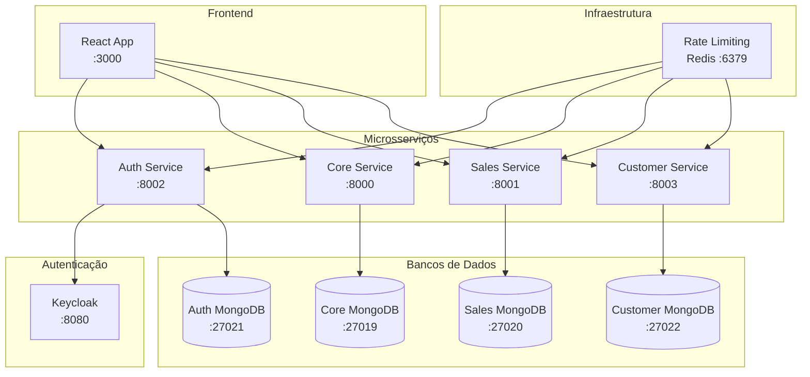

# Sistema de Vendas de Veículos - Microsserviços

[](docs/CROSS_PLATFORM_COMPATIBILITY.md)
[](https://www.docker.com/products/docker-desktop)
[](https://www.python.org/downloads/)

## 📋 Visão Geral

Sistema completo de vendas de veículos construído com arquitetura de microsserviços, incluindo autenticação robusta, gestão de clientes, catálogo de veículos e processamento de vendas.

🌐 **Agora 100% compatível com Windows, MacOS e Linux!**

## 🚀 Início Rápido

### ✅ Compatibilidade entre Sistemas Operacionais

Este projeto é **totalmente compatível** com Windows, MacOS e Linux!

#### 🔍 Verificar Compatibilidade
```bash
# Verificar dependências e compatibilidade do sistema
python3 scripts/check-dependencies.py

# Ou usar o comando Make
make check-dependencies
```

### 📋 Pré-requisitos por Sistema

#### 🪟 Windows
- **Docker Desktop** (obrigatório)
- **Python 3.8+** (Microsoft Store recomendado)
- **Git Bash** (opcional, para scripts Unix)

#### 🍎 MacOS
- **Docker Desktop**
- **Homebrew** (para dependências)
- **Python 3.8+** (via Homebrew)

#### 🐧 Linux
- **Docker e Docker Compose**
- **Python 3.8+**
- **curl** (verificar instalação)

### 🚀 Configuração Automática

#### Todas as Plataformas (Recomendado)
```bash
# Configuração completa em um comando - funciona em todos os SOs
make setup-complete
```

#### Windows (PowerShell)
```powershell
# Método alternativo para Windows
powershell -ExecutionPolicy Bypass -File scripts/setup-complete.ps1
```

#### Windows (Git Bash)
```bash
# Se preferir usar Git Bash no Windows
./scripts/setup-complete.sh
```

### 📋 Configuração Passo a Passo

#### 1. Iniciar o Sistema
```bash
# Iniciar todos os serviços
make up

# Aguardar todos os serviços ficarem prontos (pode levar alguns minutos)
make status
```

#### 2. Configurar Autenticação e Popular Dados
```bash
# Configuração completa em um comando
make setup-complete

# OU execute passo a passo:
make setup-admin     # Configura usuário admin no Keycloak
make fix-keycloak    # Corrige configuração do client
make populate-data   # Popula dados de teste (compatível com todos os SOs)
```

#### 3. Acessar o Sistema
- **Frontend**: http://localhost:3000
- **Login**: admin@vehiclesales.com / admin123

#### 4. Comandos Úteis
```bash
make logs           # Ver logs de todos os serviços
make restart        # Reiniciar serviços
make clean          # Limpar containers e volumes
make test-compatibility  # Testar compatibilidade do sistema
```

## 🔐 Credenciais de Acesso

### Usuário Admin
- **Email**: admin@vehiclesales.com
- **Senha**: admin123
- **Role**: ADMIN

### Keycloak Admin
- **URL**: http://localhost:8080/admin
- **Usuário**: admin
- **Senha**: admin123

## 📊 Dados de Teste

Após executar `make setup-complete`, o sistema terá:
- ✅ 100 veículos com dados realistas
- ✅ Usuário admin configurado
- ✅ Sistema de autenticação funcionando
- ✅ Keycloak configurado corretamente

## 🏗️ Arquitetura



## 🛠️ Resolução de Problemas

### 🔍 Diagnóstico Geral
```bash
# Verificar compatibilidade e dependências
python3 scripts/check-dependencies.py

# Verificar sistema operacional detectado
make test-compatibility
```

### 🪟 Problemas Específicos do Windows

#### "Scripts .sh não funcionam"
**Solução**: Use métodos alternativos:
```powershell
# Método 1: PowerShell (recomendado)
powershell -ExecutionPolicy Bypass -File scripts/setup-complete.ps1

# Método 2: Git Bash
./scripts/setup-complete.sh

# Método 3: Python direto
python scripts/populate-data.py
```

#### "docker não é reconhecido"
**Solução**: 
- Verificar se Docker Desktop está rodando
- Adicionar Docker ao PATH do sistema
- Reiniciar terminal

#### "python não é reconhecido"
**Solução**:
- Instalar Python via Microsoft Store
- Ou usar `py` ao invés de `python`

### 🚨 Problemas Gerais

#### "Falha ao fazer login do admin"
**Solução**: Execute a configuração completa:
```bash
make setup-complete
```

#### "Serviço não está respondendo"
**Solução**: Verifique o status e reinicie se necessário:
```bash
make status
make restart
```

#### "Keycloak não está acessível"
**Solução**: Aguarde o Keycloak inicializar completamente:
```bash
# Aguarde até que todos os serviços estejam "healthy"
make status

# Se necessário, reinicie apenas o Keycloak
docker-compose restart keycloak
```

#### "Dados não foram criados"
**Solução**: Execute a população de dados:
```bash
make populate-data  # Funciona em todos os SOs
```

## 🔧 Comandos de Manutenção

### 🔍 Diagnóstico e Compatibilidade
```bash
make check-dependencies    # Verifica dependências do sistema
make test-compatibility   # Testa compatibilidade entre SOs
```

### ⚙️ Configuração
```bash
make setup-admin           # Configura usuário admin
make fix-keycloak         # Corrige configuração do Keycloak
make setup-complete       # Configuração completa (todos os SOs)
```

### 📊 População de Dados
```bash
make populate-data        # Popula dados (compatível com todos os SOs)
make populate-data-clean  # Limpa bancos e popula dados
```

### 📋 Monitoramento
```bash
make logs                 # Logs de todos os serviços
make auth-logs           # Logs apenas do auth-service
make core-logs           # Logs apenas do core-service
make status              # Status dos containers
```

### 🧹 Limpeza
```bash
make clean               # Remove containers e volumes
make clean-dbs           # Limpa apenas bancos de dados
make clean-redis         # Limpa cache Redis
```

## 📱 Funcionalidades Implementadas

### ✅ Sistema de Autenticação
- Login/logout com Keycloak
- Controle de acesso baseado em roles (ADMIN, CUSTOMER, SALES)
- Tokens JWT com renovação automática
- Middleware de autenticação em todos os serviços

### ✅ Gestão de Veículos
- CRUD completo de veículos
- Filtros avançados (marca, modelo, ano, preço)
- Ordenação por preço (crescente/decrescente)
- Status de disponibilidade

### ✅ Gestão de Clientes
- CRUD completo de clientes
- Validação de CPF, email, telefone
- Campos completos (nome, endereço, cidade, estado, CEP)
- Busca por múltiplos critérios

### ✅ Sistema de Vendas
- Registro de vendas
- Histórico de transações
- Relatórios de vendas
- Integração com clientes e veículos

### ✅ Rate Limiting
- Controle de taxa por endpoint
- Configuração diferenciada por tipo de operação
- Fallback em memória quando Redis não disponível
- Endpoints de gerenciamento para admins

### ✅ Observabilidade
- Logs estruturados
- Health checks em todos os serviços
- Métricas de rate limiting
- Monitoramento de conectividade

### ✅ Compatibilidade Multiplataforma
- **100% compatível** com Windows, MacOS e Linux
- Detecção automática de sistema operacional
- Scripts PowerShell para Windows
- Scripts Python multiplataforma
- Makefile inteligente com comandos condicionais
- Verificação automática de dependências

## 🔄 Fluxo de Desenvolvimento

### 1. **Verificação Inicial** (Todos os SOs):
```bash
# Verificar compatibilidade e dependências
make check-dependencies

# Verificar se sistema está configurado corretamente
make test-compatibility
```

### 2. **Desenvolvimento Local**:
```bash
make up
make setup-complete  # Configuração automática
# Desenvolver...
make logs  # Para debug
```

### 3. **Testes**:
```bash
make test
make test-rate-limiting
```

### 4. **Limpeza**:
```bash
make clean
make up
```

## 📚 Documentação Adicional

### 🔧 Documentação Técnica
- [Arquitetura Detalhada](docs/ARCHITECTURE.md)
- [Documentação das APIs](docs/API_DOCUMENTATION.md)
- [Guia de Deployment](docs/DEPLOYMENT.md)
- [Variáveis de Ambiente](docs/ENVIRONMENT_VARIABLES.md)
- [Guia de População de Dados](docs/POPULATE_DATA_GUIDE.md)

### 🌐 Compatibilidade entre Sistemas
- [**Compatibilidade Multiplataforma**](docs/CROSS_PLATFORM_COMPATIBILITY.md) - Análise completa de compatibilidade
- [**Guia Windows**](docs/WINDOWS_SETUP_GUIDE.md) - Configuração específica para Windows
- [Guia Keycloak](docs/KEYCLOAK_QUICKSTART.md)
- [Guia Produção Keycloak](docs/KEYCLOAK_PRODUCTION_GUIDE.md)

### 🔍 Ferramentas de Diagnóstico
- `scripts/check-dependencies.py` - Verificação de dependências
- `scripts/setup-complete.ps1` - Configuração para Windows
- `make check-dependencies` - Comando de verificação
- `make test-compatibility` - Teste de compatibilidade

## 🤝 Contribuição

1. Fork o projeto
2. Crie uma branch para sua feature (`git checkout -b feature/AmazingFeature`)
3. Commit suas mudanças (`git commit -m 'Add some AmazingFeature'`)
4. Push para a branch (`git push origin feature/AmazingFeature`)
5. Abra um Pull Request

## 🎯 Status de Compatibilidade

| Sistema Operacional | Status | Configuração | Scripts |
|-------------------|--------|-------------|---------|
| 🪟 **Windows** | ✅ **Totalmente Compatível** | PowerShell + Python | `.ps1` + `.py` |
| 🍎 **MacOS** | ✅ **Totalmente Compatível** | Bash + Python | `.sh` + `.py` |
| 🐧 **Linux** | ✅ **Totalmente Compatível** | Bash + Python | `.sh` + `.py` |

### 🔧 Recursos de Compatibilidade
- ✅ **Detecção automática** de sistema operacional
- ✅ **Scripts condicionais** no Makefile
- ✅ **Verificação de dependências** automática
- ✅ **Documentação específica** por plataforma
- ✅ **Resolução de problemas** por sistema

### 🚀 Comandos Universais
```bash
make check-dependencies    # Funciona em todos os SOs
make setup-complete       # Configuração automática
make populate-data        # População de dados
make test-compatibility   # Testa compatibilidade
```

## 📄 Licença

Este projeto está sob a licença MIT. Veja o arquivo [LICENSE](LICENSE) para mais detalhes.

---

⭐ Se este projeto foi útil para você, considere dar uma estrela no repositório!

🌐 **Agora 100% compatível com Windows, MacOS e Linux!** 

