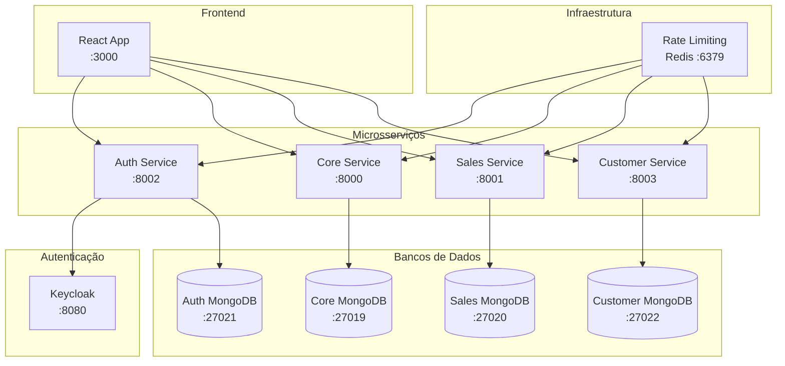

# Sistema de Vendas de Veículos - Microsserviços

## 📋 Visão Geral

Sistema completo de vendas de veículos construído com arquitetura de microsserviços, incluindo autenticação robusta, gestão de clientes, catálogo de veículos e processamento de vendas.

## 🚀 Início Rápido

### 1. Iniciar o Sistema
```bash
# Iniciar todos os serviços
make up

# Aguardar todos os serviços ficarem prontos (pode levar alguns minutos)
make status
```

### 2. Configurar Autenticação e Popular Dados
```bash
# Configuração completa em um comando
make setup-complete

# OU execute passo a passo:
make setup-admin     # Configura usuário admin no Keycloak
make fix-keycloak    # Corrige configuração do client
make populate-data-working  # Popula dados de teste
```

### 3. Acessar o Sistema
- **Frontend**: http://localhost:3000
- **Login**: admin@vehiclesales.com / admin123

### 4. Comandos Úteis
```bash
make logs           # Ver logs de todos os serviços
make restart        # Reiniciar serviços
make clean          # Limpar containers e volumes
make help           # Ver todos os comandos disponíveis
```

## 🔐 Credenciais de Acesso

### Usuário Admin
- **Email**: admin@vehiclesales.com
- **Senha**: admin123
- **Role**: ADMIN

### Keycloak Admin
- **URL**: http://localhost:8080/admin
- **Usuário**: admin
- **Senha**: admin123

## 📊 Dados de Teste

Após executar `make setup-complete`, o sistema terá:
- ✅ 100 veículos com dados realistas
- ✅ Usuário admin configurado
- ✅ Sistema de autenticação funcionando
- ✅ Keycloak configurado corretamente

## 🏗️ Arquitetura



## 🛠️ Resolução de Problemas

### Problema: "Falha ao fazer login do admin"

**Solução**: Execute a configuração completa:
```bash
make setup-complete
```

### Problema: "Serviço não está respondendo"

**Solução**: Verifique o status e reinicie se necessário:
```bash
make status
make restart
```

### Problema: "Keycloak não está acessível"

**Solução**: Aguarde o Keycloak inicializar completamente:
```bash
# Aguarde até que todos os serviços estejam "healthy"
make status

# Se necessário, reinicie apenas o Keycloak
docker-compose restart keycloak
```

### Problema: "Dados não foram criados"

**Solução**: Execute a população de dados:
```bash
make populate-data-working
```

## 🔧 Comandos de Manutenção

### Configuração
```bash
make setup-admin           # Configura usuário admin
make fix-keycloak         # Corrige configuração do Keycloak
make setup-complete       # Configuração completa
```

### População de Dados
```bash
make populate-data-working  # Popula dados (versão funcional)
make populate-data-clean   # Limpa bancos e popula dados
```

### Monitoramento
```bash
make logs                 # Logs de todos os serviços
make auth-logs           # Logs apenas do auth-service
make core-logs           # Logs apenas do core-service
make status              # Status dos containers
```

### Limpeza
```bash
make clean               # Remove containers e volumes
make clean-dbs           # Limpa apenas bancos de dados
make clean-redis         # Limpa cache Redis
```

## 📱 Funcionalidades Implementadas

### ✅ Sistema de Autenticação
- Login/logout com Keycloak
- Controle de acesso baseado em roles (ADMIN, CUSTOMER, SALES)
- Tokens JWT com renovação automática
- Middleware de autenticação em todos os serviços

### ✅ Gestão de Veículos
- CRUD completo de veículos
- Filtros avançados (marca, modelo, ano, preço)
- Ordenação por preço (crescente/decrescente)
- Status de disponibilidade

### ✅ Gestão de Clientes
- CRUD completo de clientes
- Validação de CPF, email, telefone
- Campos completos (nome, endereço, cidade, estado, CEP)
- Busca por múltiplos critérios

### ✅ Sistema de Vendas
- Registro de vendas
- Histórico de transações
- Relatórios de vendas
- Integração com clientes e veículos

### ✅ Rate Limiting
- Controle de taxa por endpoint
- Configuração diferenciada por tipo de operação
- Fallback em memória quando Redis não disponível
- Endpoints de gerenciamento para admins

### ✅ Observabilidade
- Logs estruturados
- Health checks em todos os serviços
- Métricas de rate limiting
- Monitoramento de conectividade

## 🔄 Fluxo de Desenvolvimento

1. **Desenvolvimento Local**:
   ```bash
   make up
   make setup-complete
   # Desenvolver...
   make logs  # Para debug
   ```

2. **Testes**:
   ```bash
   make test
   make test-rate-limiting
   ```

3. **Limpeza**:
   ```bash
   make clean
   make up
   ```

## 📚 Documentação Adicional

- [Arquitetura Detalhada](docs/ARCHITECTURE.md)
- [Documentação das APIs](docs/API_DOCUMENTATION.md)
- [Guia de Deployment](docs/DEPLOYMENT.md)
- [Variáveis de Ambiente](docs/ENVIRONMENT_VARIABLES.md)
- [Guia de População de Dados](docs/POPULATE_DATA_GUIDE.md)

## 🤝 Contribuição

1. Fork o projeto
2. Crie uma branch para sua feature (`git checkout -b feature/AmazingFeature`)
3. Commit suas mudanças (`git commit -m 'Add some AmazingFeature'`)
4. Push para a branch (`git push origin feature/AmazingFeature`)
5. Abra um Pull Request

## 📄 Licença

Este projeto está sob a licença MIT. Veja o arquivo [LICENSE](LICENSE) para mais detalhes.

---

⭐ Se este projeto foi útil para você, considere dar uma estrela no repositório! 

