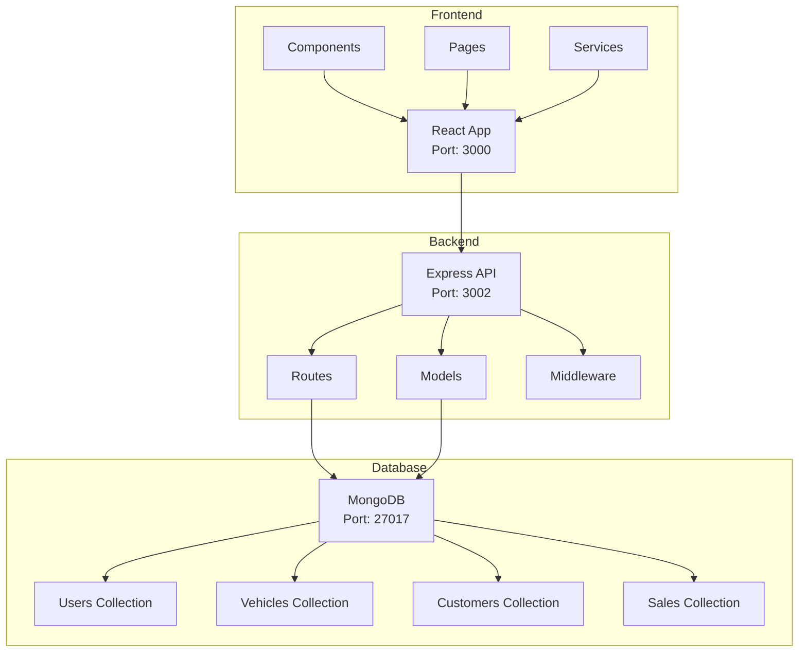
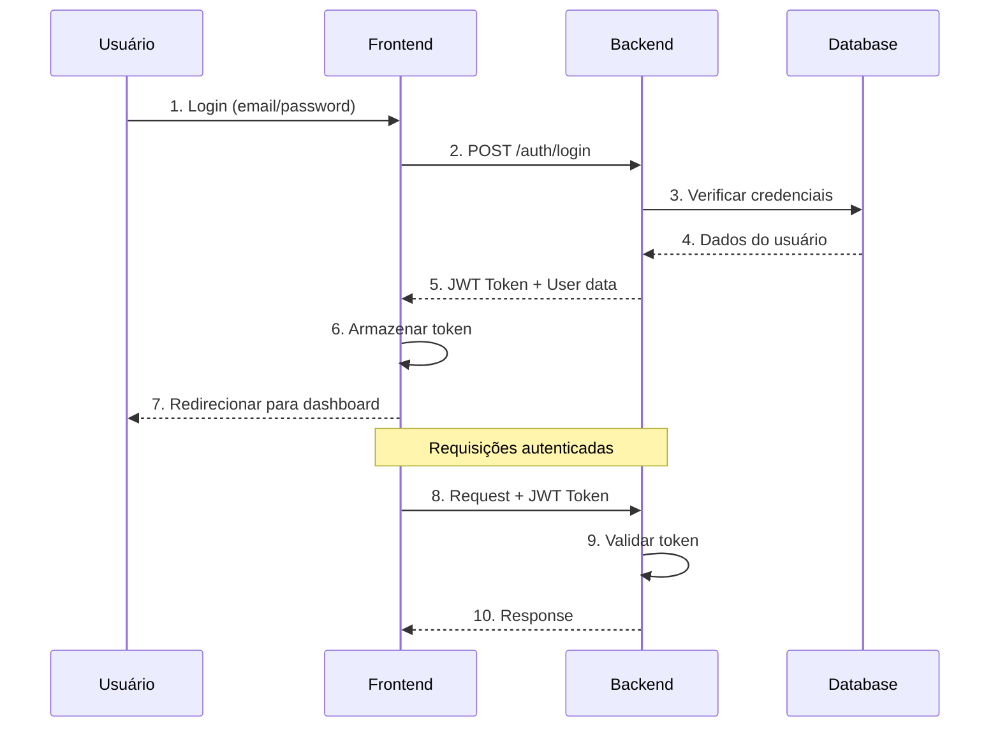
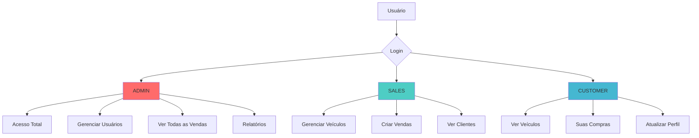

# 🚗 FIAP III

[](https://nodejs.org/)
[](https://reactjs.org/)
[](https://mongodb.com/)
[](https://typescriptlang.org/)
[](LICENSE)
[](README.md)
[](Makefile)

Sistema completo de gerenciamento de vendas de veículos com autenticação, controle de estoque e processamento de pagamentos.

## 📋 Visão Geral

Este sistema foi desenvolvido como uma solução unificada que combina:
- **Backend API** em Node.js com Express
- **Frontend** em React com TypeScript
- **Banco de dados** MongoDB
- **Autenticação** JWT com controle de roles
- **Makefile** para facilitar o gerenciamento

## ⚡ Início Rápido

```bash
# Clone o repositório
git clone <repository-url>
cd fiap-prova-sub-fase-3

# Setup completo automático
make setup

# Iniciar o sistema
make start
```

**Acesso:**
- 🌐 Frontend: http://localhost:3000
- 🔧 API: http://localhost:3002
- 🔑 Credenciais: admin@vehiclesales.com / admin123

### 🎬 Demo Rápida

```bash
# 1. Clone e setup
git clone <repository-url>
cd fiap-prova-sub-fase-3
make setup

# 2. Iniciar sistema
make start

# 3. Acessar aplicação
# Frontend: http://localhost:3000
# Login: admin@vehiclesales.com / admin123
```

## 🏗️ Arquitetura

### Diagrama da Arquitetura


### Estrutura do Projeto
```
fiap-prova-sub-fase-3/
├── backend/          # API Node.js unificada
│   ├── src/
│   │   ├── routes/   # Rotas da API
│   │   ├── models/   # Modelos do banco
│   │   ├── middleware/ # Middlewares
│   │   └── utils/    # Utilitários
│   └── package.json
├── frontend/         # Aplicação React
│   ├── src/
│   │   ├── pages/    # Páginas da aplicação
│   │   ├── components/ # Componentes
│   │   └── services/ # Serviços de API
│   └── package.json
└── docs/            # Documentação
```

## ✨ Funcionalidades

### 🔐 Autenticação e Autorização
- ✅ Login/Logout com JWT
- ✅ Controle de roles (ADMIN, SALES, CUSTOMER)
- ✅ Middleware de autenticação
- ✅ Validação de tokens
- ✅ Refresh tokens
- ✅ Rate limiting

### Fluxo de Autenticação


### 🚗 Gestão de Veículos
- ✅ CRUD completo de veículos
- ✅ Controle de status (DISPONÍVEL, RESERVADO, VENDIDO)
- ✅ Filtros e busca avançada
- ✅ Validação de dados
- ✅ Upload de imagens
- ✅ Histórico de alterações

### 👥 Gestão de Clientes
- ✅ CRUD de clientes
- ✅ Validação de CPF
- ✅ Busca por CPF, email, nome
- ✅ Estatísticas e relatórios
- ✅ Histórico de compras
- ✅ Dados de contato completos

### 💰 Gestão de Vendas
- ✅ Criação de vendas
- ✅ Controle de status de pagamento
- ✅ Histórico de vendas
- ✅ Relatórios detalhados
- ✅ Integração com veículos e clientes
- ✅ Dashboard com métricas

## 🛠️ Tecnologias

### Backend
- **Node.js** 18+ - Runtime JavaScript
- **Express.js** - Framework web
- **MongoDB** - Banco de dados NoSQL
- **Mongoose** - ODM para MongoDB
- **JWT** - Autenticação
- **bcryptjs** - Hash de senhas
- **express-rate-limit** - Rate limiting

### Frontend
- **React** 18 - Framework de interface
- **TypeScript** - Tipagem estática
- **Material-UI** - Componentes de interface
- **Axios** - Cliente HTTP
- **Context API** - Gerenciamento de estado

### DevOps
- **Docker** - Containerização
- **Make** - Automação de tarefas
- **MongoDB** - Banco de dados

## 🚀 Instalação e Configuração

### Pré-requisitos
- Node.js 18+
- MongoDB
- npm ou yarn
- Docker (para MongoDB)
- Make (opcional, mas recomendado)

### 🎯 Setup Rápido com Makefile

```bash
# Clone o repositório
git clone <repository-url>
cd fiap-prova-sub-fase-3

# Setup completo automático
make setup

# Iniciar o sistema
make start
```

### 📋 Comandos Principais do Makefile

| Comando | Descrição |
|---------|-----------|
| `make help` | 📖 Ver todos os comandos disponíveis |
| `make setup` | 🚀 Setup completo do projeto |
| `make start` | 🚀 Iniciar backend e frontend |
| `make stop` | 🛑 Parar todos os serviços |
| `make status` | 📊 Ver status dos serviços |
| `make health` | 🏥 Verificar saúde dos serviços |
| `make clean` | 🧹 Limpeza completa |
| `make reset` | 🔄 Reset completo do projeto |

### 🎯 Comandos Mais Usados

```bash
# Desenvolvimento diário
make dev           # Modo desenvolvimento
make start         # Iniciar sistema
make stop          # Parar sistema
make status        # Ver status

# Gerenciamento
make clean         # Limpeza completa
make reset         # Reset completo
make backup        # Backup do banco
make health        # Health check
```

### 🔧 Setup Manual (Alternativo)

#### 1. Clone o repositório
```bash
git clone <repository-url>
cd fiap-prova-sub-fase-3
```

#### 2. Configure o Backend
```bash
cd backend
npm install
cp config.env.example config.env
# Edite o config.env com suas configurações
npm start
```

#### 3. Configure o Frontend
```bash
cd frontend
npm install
npm start
```

#### 4. Configure o MongoDB
```bash
# Inicie o MongoDB
docker run -d --name mongodb-unified-dev -p 27017:27017 mongo:latest --noauth

# Popule dados iniciais
cd backend
npm run populate
```

## 🔧 Configuração

### Variáveis de Ambiente (Backend)

Crie um arquivo `backend/config.env`:

```env
# Servidor
PORT=3002
NODE_ENV=development

# Banco de dados
MONGODB_URL=mongodb://localhost:27017
MONGODB_DB_NAME=vehicle_sales

# JWT
JWT_SECRET=your-super-secret-jwt-key
JWT_REFRESH_SECRET=your-super-secret-refresh-key
JWT_EXPIRES_IN=24h
JWT_REFRESH_EXPIRES_IN=7d

# CORS
ALLOWED_ORIGINS=http://localhost:3000,http://localhost:3003

# Rate Limiting
RATE_LIMIT_WINDOW_MS=900000
RATE_LIMIT_MAX_REQUESTS=100

# Logs
LOG_LEVEL=info
```

### Variáveis de Ambiente (Frontend)

Crie um arquivo `frontend/.env`:

```env
REACT_APP_BACKEND_URL=http://localhost:3002
```

## 📚 Documentação da API

### Endpoints Principais

#### Autenticação
- `POST /auth/login` - Login
- `POST /auth/register` - Registro
- `GET /auth/validate` - Validar token
- `POST /auth/refresh` - Renovar token
- `POST /auth/logout` - Logout

#### Veículos
- `GET /vehicles` - Listar veículos
- `POST /vehicles` - Criar veículo
- `GET /vehicles/:id` - Buscar veículo
- `PUT /vehicles/:id` - Atualizar veículo
- `DELETE /vehicles/:id` - Deletar veículo

#### Clientes
- `GET /customers` - Listar clientes
- `POST /customers` - Criar cliente
- `GET /customers/:id` - Buscar cliente
- `PUT /customers/:id` - Atualizar cliente
- `DELETE /customers/:id` - Deletar cliente

#### Vendas
- `GET /sales` - Listar vendas
- `POST /sales` - Criar venda
- `GET /sales/:id` - Buscar venda
- `PUT /sales/:id` - Atualizar venda
- `DELETE /sales/:id` - Deletar venda

## 👥 Roles e Permissões

### Diagrama de Roles


### ADMIN
- Acesso total ao sistema
- Pode gerenciar usuários
- Pode ver todas as vendas
- Pode acessar relatórios

### SALES
- Pode gerenciar veículos
- Pode criar e gerenciar vendas
- Pode ver clientes
- Não pode gerenciar usuários

### CUSTOMER
- Pode ver veículos disponíveis
- Pode ver suas próprias compras
- Pode atualizar seu perfil
- Não pode acessar área administrativa

## 🧪 Testes

### Testar a API
```bash
cd backend
npm test
```

### Testar o Frontend
```bash
cd frontend
npm test
```

### Testar Integração
```bash
# Verificar se a API está funcionando
curl http://localhost:3002/health

# Testar login
curl -X POST http://localhost:3002/auth/login \
  -H "Content-Type: application/json" \
  -d '{"email": "admin@vehiclesales.com", "password": "admin123"}'
```

## 🚀 Deploy

### Com Makefile (Recomendado)
```bash
# Desenvolvimento
make dev

# Produção
make prod

# Deploy local
make deploy
```

### Manual
```bash
# Desenvolvimento
# Terminal 1 - Backend
cd backend && npm start

# Terminal 2 - Frontend
cd frontend && npm start

# Produção
# Build do frontend
cd frontend && npm run build

# Iniciar backend
cd backend && npm start
```

## 🛠️ Makefile - Comandos Avançados

### Comandos de Desenvolvimento
```bash
make dev           # Modo desenvolvimento
make start         # Iniciar todos os serviços
make start-backend # Apenas backend
make start-frontend # Apenas frontend
make stop          # Parar todos os serviços
```

### Comandos de Gerenciamento
```bash
make status        # Status dos serviços
make health        # Health check
make logs          # Ver logs
make clean         # Limpeza completa
make reset         # Reset completo
```

### Comandos de Banco de Dados
```bash
make mongodb       # Iniciar MongoDB
make populate      # Popular dados
make backup        # Backup do banco
make restore       # Restaurar backup
```

### Comandos de Produção
```bash
make build         # Build para produção
make deploy        # Deploy local
make prod          # Modo produção
```

### Comandos de Informação
```bash
make help          # Ajuda completa
make info          # Informações do projeto
make test          # Executar testes
```

### 🚀 Comandos Úteis para Desenvolvimento

```bash
# Desenvolvimento diário
make dev           # Iniciar em modo desenvolvimento
make status        # Ver status dos serviços
make health        # Verificar saúde da API
make logs          # Ver logs em tempo real

# Gerenciamento de dados
make populate      # Popular banco com dados de teste
make backup        # Fazer backup do banco
make restore       # Restaurar backup

# Manutenção
make clean         # Limpeza completa
make reset         # Reset completo do projeto
make stop          # Parar todos os serviços
```

## 📊 Dados Iniciais

O sistema vem com dados de exemplo:

### Usuário Admin
- **Email**: admin@vehiclesales.com
- **Senha**: admin123
- **Role**: ADMIN

### Veículos de Exemplo
- Honda Civic 2023
- Toyota Corolla 2022
- Ford Focus 2021

### Clientes de Exemplo
- João Silva
- Maria Santos
- Pedro Oliveira

## 🔍 Troubleshooting

### Problemas Comuns

#### API não conecta ao MongoDB
```bash
# Verificar status
make status

# Reiniciar MongoDB
make stop-mongodb
make mongodb
```

#### Erro de CORS
```bash
# Verificar configuração
# Editar backend/config.env
ALLOWED_ORIGINS=http://localhost:3000,http://localhost:3003

# Reiniciar backend
make stop
make start-backend
```

#### Token inválido
```bash
# Limpar localStorage do navegador
# Ou fazer logout e login novamente
```

#### Porta em uso
```bash
# Verificar processos
make status

# Parar todos os serviços
make stop

# Reiniciar
make start
```

### 🆘 Comandos de Diagnóstico

```bash
make status        # Status dos serviços
make health        # Health check da API
make logs          # Ver logs
make info          # Informações do sistema
```

## 📝 Logs

### Backend
```bash
# Ver logs em tempo real
cd backend && npm start

# Logs são exibidos no console
```

### Frontend
```bash
# Ver logs no console do navegador
# F12 -> Console
```

## 🤝 Contribuição

1. Fork o projeto
2. Crie uma branch para sua feature
3. Commit suas mudanças
4. Push para a branch
5. Abra um Pull Request

## 📄 Licença

Este projeto está sob a licença MIT. Veja o arquivo LICENSE para mais detalhes.

## 📊 Status do Projeto

### ✅ Funcionalidades Implementadas
- [x] Autenticação e autorização
- [x] Gestão de veículos
- [x] Gestão de clientes
- [x] Gestão de vendas
- [x] Dashboard com métricas
- [x] API REST completa
- [x] Frontend responsivo
- [x] Documentação completa
- [x] Makefile para automação
- [x] Testes de integração

### 🚀 Próximos Passos
- [ ] Testes automatizados
- [ ] CI/CD pipeline
- [ ] Deploy em produção
- [ ] Monitoramento
- [ ] Logs estruturados

## 📞 Suporte

Para suporte e dúvidas:

1. **Consulte a documentação** em `docs/`
2. **Verifique os logs** com `make logs`
3. **Execute health check** com `make health`
4. **Entre em contato** através de:
   - Email: suporte@vehiclesales.com
   - Issues: [GitHub Issues](link-para-issues)

## 📄 Licença

Este projeto está sob a licença MIT. Veja o arquivo LICENSE para mais detalhes.

## 🤝 Contribuição

1. Fork o projeto
2. Crie uma branch para sua feature (`git checkout -b feature/AmazingFeature`)
3. Commit suas mudanças (`git commit -m 'Add some AmazingFeature'`)
4. Push para a branch (`git push origin feature/AmazingFeature`)
5. Abra um Pull Request

---

**Desenvolvido com ❤️ para FIAP**

*FIAP III - Refatoração de microserviços para API unificada*