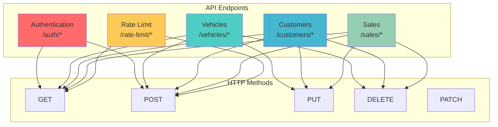
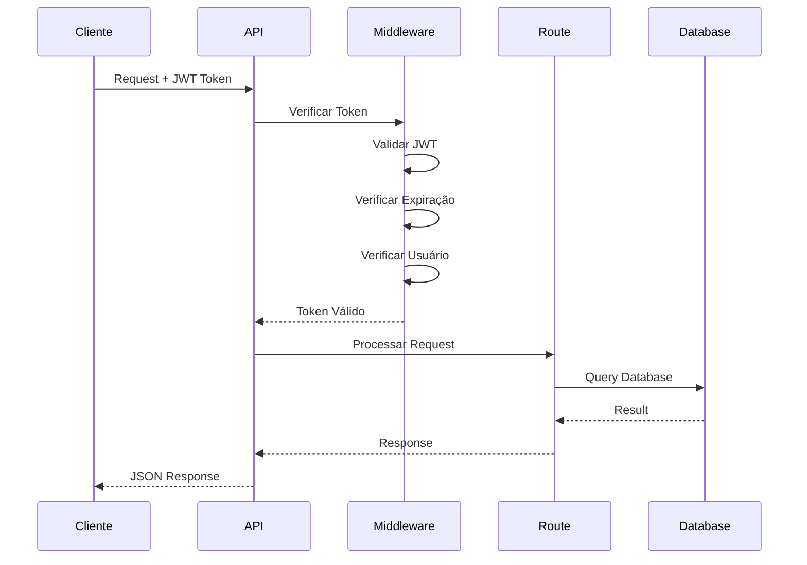

# 📚 Documentação da API

## Visão Geral

A API do FIAP III de Veículos é uma API REST construída com Node.js e Express, fornecendo endpoints para autenticação, gerenciamento de veículos, clientes e vendas.

**Base URL**: `http://localhost:3002`

### Diagrama da API


## Autenticação

A API utiliza JWT (JSON Web Tokens) para autenticação. Inclua o token no header `Authorization`:

```
Authorization: Bearer <token>
```

### Fluxo de Requisição Autenticada


## Endpoints

### 🔐 Autenticação

#### POST /auth/login
Realiza login do usuário.

**Request Body**:
```json
{
  "email": "admin@vehiclesales.com",
  "password": "admin123"
}
```

**Response**:
```json
{
  "access_token": "eyJhbGciOiJIUzI1NiIsInR5cCI6IkpXVCJ9...",
  "refresh_token": "eyJhbGciOiJIUzI1NiIsInR5cCI6IkpXVCJ9...",
  "token_type": "bearer",
  "expires_in": 86400,
  "user": {
    "id": "68baf9e6e4125327c75a392f",
    "email": "admin@vehiclesales.com",
    "name": "Administrador",
    "role": "ADMIN",
    "status": "ACTIVE",
    "createdAt": "2025-09-05T14:55:34.057Z",
    "updatedAt": "2025-09-05T15:19:08.428Z"
  }
}
```

#### POST /auth/register
Registra um novo usuário.

**Request Body**:
```json
{
  "email": "user@example.com",
  "password": "password123",
  "name": "Nome do Usuário",
  "role": "CUSTOMER"
}
```

#### GET /auth/validate
Valida o token de acesso.

**Headers**:
```
Authorization: Bearer <token>
```

**Response**:
```json
{
  "valid": true,
  "user": {
    "id": "68baf9e6e4125327c75a392f",
    "email": "admin@vehiclesales.com",
    "name": "Administrador",
    "role": "ADMIN",
    "status": "ACTIVE"
  },
  "expires_at": "2025-09-06T15:19:55.000Z"
}
```

#### POST /auth/refresh
Renova o token de acesso.

**Request Body**:
```json
{
  "refresh_token": "eyJhbGciOiJIUzI1NiIsInR5cCI6IkpXVCJ9..."
}
```

#### POST /auth/logout
Realiza logout do usuário.

**Request Body**:
```json
{
  "refresh_token": "eyJhbGciOiJIUzI1NiIsInR5cCI6IkpXVCJ9..."
}
```

### 🚗 Veículos

#### GET /vehicles
Lista todos os veículos.

**Query Parameters**:
- `status` - Filtrar por status (DISPONÍVEL, RESERVADO, VENDIDO)
- `brand` - Filtrar por marca
- `model` - Filtrar por modelo
- `min_price` - Preço mínimo
- `max_price` - Preço máximo
- `skip` - Número de registros para pular
- `limit` - Número máximo de registros

**Response**:
```json
[
  {
    "id": "68baf9e6e4125327c75a392f",
    "brand": "Honda",
    "model": "Civic",
    "year": 2023,
    "color": "Branco",
    "price": 85000,
    "status": "DISPONÍVEL",
    "createdAt": "2025-09-05T14:55:34.057Z",
    "updatedAt": "2025-09-05T14:55:34.057Z"
  }
]
```

#### POST /vehicles
Cria um novo veículo.

**Headers**:
```
Authorization: Bearer <token>
Content-Type: application/json
```

**Request Body**:
```json
{
  "brand": "Toyota",
  "model": "Corolla",
  "year": 2022,
  "color": "Prata",
  "price": 75000,
  "status": "DISPONÍVEL"
}
```

#### GET /vehicles/:id
Busca um veículo específico.

**Response**:
```json
{
  "id": "68baf9e6e4125327c75a392f",
  "brand": "Honda",
  "model": "Civic",
  "year": 2023,
  "color": "Branco",
  "price": 85000,
  "status": "DISPONÍVEL",
  "createdAt": "2025-09-05T14:55:34.057Z",
  "updatedAt": "2025-09-05T14:55:34.057Z"
}
```

#### PUT /vehicles/:id
Atualiza um veículo.

**Headers**:
```
Authorization: Bearer <token>
Content-Type: application/json
```

**Request Body**:
```json
{
  "brand": "Honda",
  "model": "Civic",
  "year": 2023,
  "color": "Preto",
  "price": 87000,
  "status": "RESERVADO"
}
```

#### DELETE /vehicles/:id
Remove um veículo.

**Headers**:
```
Authorization: Bearer <token>
```

### 👥 Clientes

#### GET /customers
Lista todos os clientes.

**Query Parameters**:
- `search` - Busca por nome, email ou CPF
- `skip` - Número de registros para pular
- `limit` - Número máximo de registros

**Response**:
```json
[
  {
    "id": "68baf9e6e4125327c75a392f",
    "name": "João Silva",
    "email": "joao@example.com",
    "phone": "(11) 99999-9999",
    "cpf": "123.456.789-00",
    "address": "Rua das Flores, 123",
    "city": "São Paulo",
    "state": "SP",
    "zip_code": "01234-567",
    "active": true,
    "createdAt": "2025-09-05T14:55:34.057Z",
    "updatedAt": "2025-09-05T14:55:34.057Z"
  }
]
```

#### POST /customers
Cria um novo cliente.

**Request Body**:
```json
{
  "name": "Maria Santos",
  "email": "maria@example.com",
  "phone": "(11) 88888-8888",
  "cpf": "987.654.321-00",
  "address": "Av. Paulista, 1000",
  "city": "São Paulo",
  "state": "SP",
  "zip_code": "01310-100"
}
```

#### GET /customers/:id
Busca um cliente específico.

#### PUT /customers/:id
Atualiza um cliente.

#### DELETE /customers/:id
Remove um cliente.

#### GET /customers/cpf/:cpf
Busca cliente por CPF.

#### GET /customers/email/:email
Busca cliente por email.

#### GET /customers/stats/summary
Retorna estatísticas dos clientes.

**Response**:
```json
{
  "total_customers": 150,
  "active_customers": 145,
  "inactive_customers": 5,
  "new_customers_this_month": 12
}
```

### 💰 Vendas

#### GET /sales
Lista todas as vendas.

**Query Parameters**:
- `status` - Filtrar por status de pagamento
- `customer_cpf` - Filtrar por CPF do cliente
- `skip` - Número de registros para pular
- `limit` - Número máximo de registros

**Response**:
```json
[
  {
    "id": "68baf9e6e4125327c75a392f",
    "vehicle_id": "68baf9e6e4125327c75a392f",
    "buyer_cpf": "123.456.789-00",
    "sale_price": 85000,
    "payment_code": "PAY123456",
    "payment_status": "PAGO",
    "createdAt": "2025-09-05T14:55:34.057Z",
    "updatedAt": "2025-09-05T14:55:34.057Z"
  }
]
```

#### POST /sales
Cria uma nova venda.

**Headers**:
```
Authorization: Bearer <token>
Content-Type: application/json
```

**Request Body**:
```json
{
  "vehicle_id": "68baf9e6e4125327c75a392f",
  "buyer_cpf": "123.456.789-00",
  "sale_price": 85000,
  "payment_code": "PAY123456"
}
```

#### GET /sales/:id
Busca uma venda específica.

#### PUT /sales/:id
Atualiza uma venda.

#### DELETE /sales/:id
Remove uma venda.

#### POST /sales/:id/confirm-payment
Confirma o pagamento de uma venda.

#### POST /sales/:id/cancel-payment
Cancela o pagamento de uma venda.

### 📊 Rate Limiting

#### GET /rate-limit/stats
Retorna estatísticas de rate limiting.

**Response**:
```json
{
  "key": "127.0.0.1",
  "statistics": {
    "total_requests": 150,
    "remaining_requests": 50,
    "reset_time": "2025-09-05T16:00:00.000Z"
  },
  "message": "Rate limit statistics"
}
```

#### GET /rate-limit/config
Retorna configuração de rate limiting.

#### POST /rate-limit/reset
Reseta o rate limiting para um IP específico.

## Códigos de Status HTTP

- `200` - Sucesso
- `201` - Criado com sucesso
- `400` - Dados inválidos
- `401` - Não autenticado
- `403` - Acesso negado
- `404` - Recurso não encontrado
- `429` - Rate limit excedido
- `500` - Erro interno do servidor

## Tratamento de Erros

### Formato de Erro
```json
{
  "error": "Mensagem de erro",
  "details": "Detalhes adicionais (opcional)"
}
```

### Exemplos de Erros

#### 400 - Dados Inválidos
```json
{
  "error": "Dados inválidos",
  "details": [
    {
      "field": "email",
      "message": "Email é obrigatório"
    }
  ]
}
```

#### 401 - Não Autenticado
```json
{
  "error": "Token de acesso necessário"
}
```

#### 403 - Acesso Negado
```json
{
  "error": "Acesso negado",
  "required_roles": ["ADMIN"],
  "user_roles": ["CUSTOMER"]
}
```

#### 404 - Recurso Não Encontrado
```json
{
  "error": "Veículo não encontrado"
}
```

#### 429 - Rate Limit Excedido
```json
{
  "error": "Rate limit excedido",
  "retry_after": 900
}
```

## Rate Limiting

A API implementa rate limiting para proteger contra abuso:

- **Limite**: 100 requisições por 15 minutos por IP
- **Headers de resposta**:
  - `X-RateLimit-Limit`: Limite total
  - `X-RateLimit-Remaining`: Requisições restantes
  - `X-RateLimit-Reset`: Timestamp de reset

## CORS

A API suporta CORS para requisições cross-origin:

- **Origens permitidas**: Configuráveis via `ALLOWED_ORIGINS`
- **Métodos**: GET, POST, PUT, DELETE, PATCH, OPTIONS
- **Headers**: Content-Type, Authorization, X-Requested-With

## Exemplos de Uso

### JavaScript (Fetch)
```javascript
// Login
const response = await fetch('http://localhost:3002/auth/login', {
  method: 'POST',
  headers: {
    'Content-Type': 'application/json'
  },
  body: JSON.stringify({
    email: 'admin@vehiclesales.com',
    password: 'admin123'
  })
});

const data = await response.json();
const token = data.access_token;

// Buscar veículos
const vehiclesResponse = await fetch('http://localhost:3002/vehicles', {
  headers: {
    'Authorization': `Bearer ${token}`
  }
});

const vehicles = await vehiclesResponse.json();
```

### cURL
```bash
# Login
curl -X POST http://localhost:3002/auth/login \
  -H "Content-Type: application/json" \
  -d '{"email": "admin@vehiclesales.com", "password": "admin123"}'

# Buscar veículos
curl -X GET http://localhost:3002/vehicles \
  -H "Authorization: Bearer <token>"
```

## Health Check

#### GET /health
Verifica o status da API.

**Response**:
```json
{
  "status": "healthy",
  "service": "unified-vehicle-api",
  "timestamp": "2025-09-05T15:40:54.701Z",
  "uptime": 7.487930698
}
```
