# Arquitetura do Sistema - Microsserviços

## Visão Geral

O sistema de vendas de veículos foi projetado seguindo uma arquitetura de microsserviços, onde cada serviço tem responsabilidades específicas e bem definidas. A arquitetura segue os princípios da **Arquitetura Hexagonal** (Ports and Adapters), garantindo alta testabilidade, manutenibilidade e escalabilidade.

## Diagrama de Arquitetura Geral

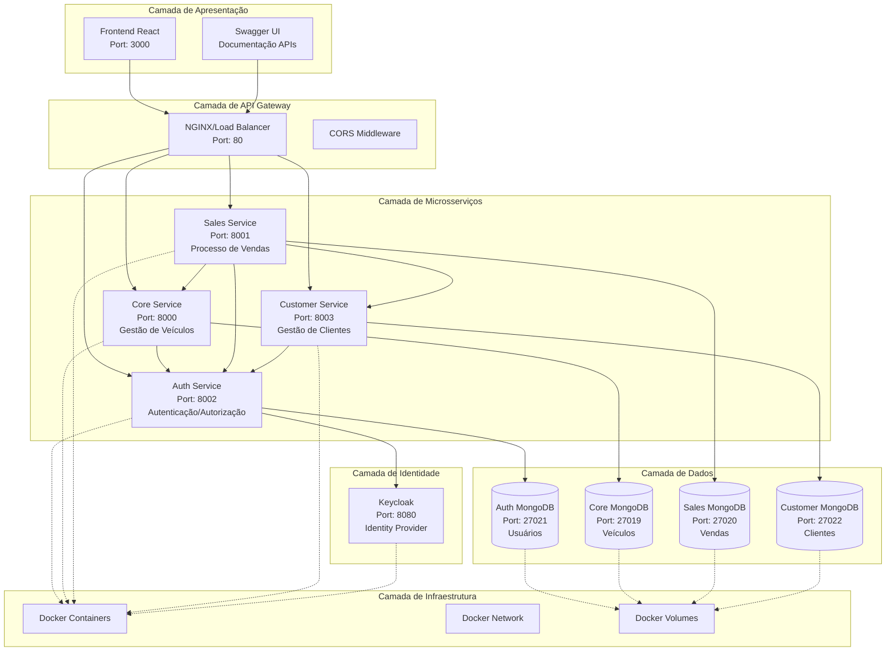

## Arquitetura Hexagonal por Serviço

### Auth Service

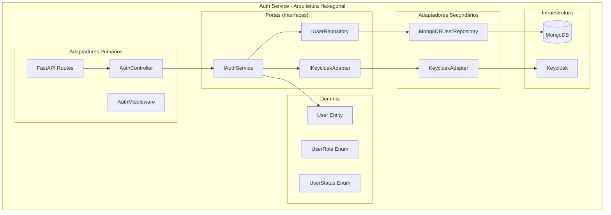

### Core Service

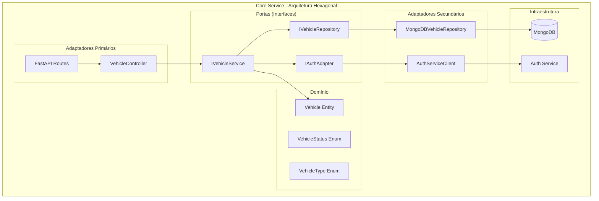

## Fluxos de Dados

### Fluxo de Autenticação

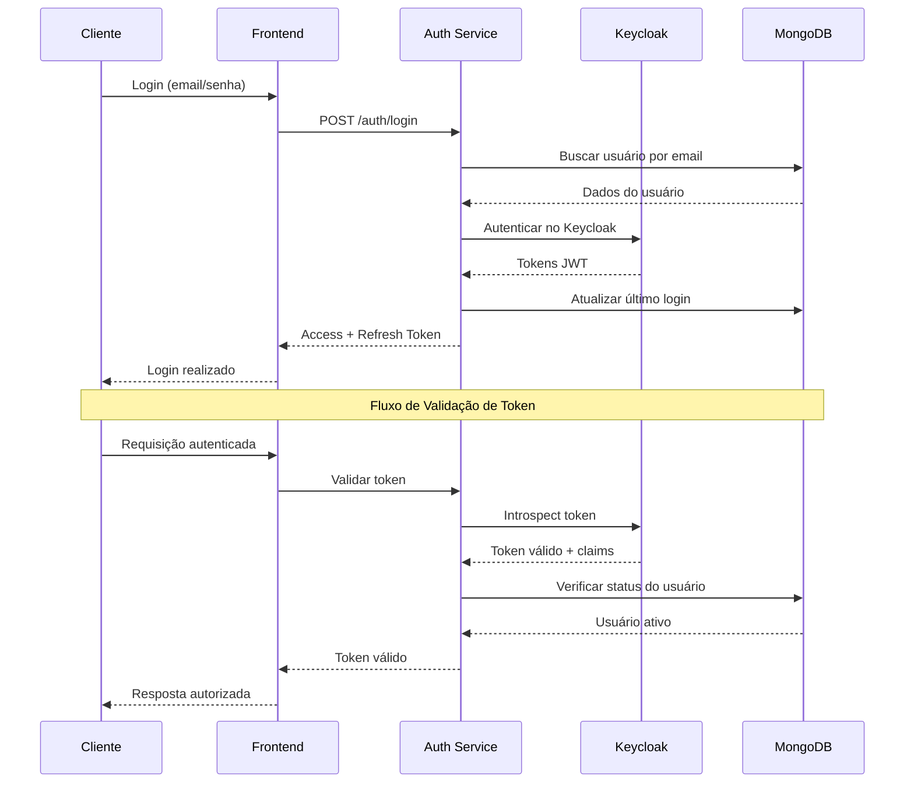

### Fluxo de Compra de Veículo

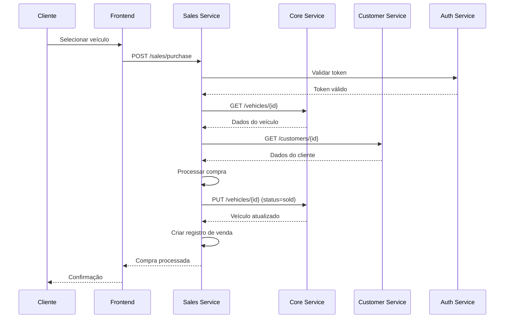

### Fluxo de Ordenação de Veículos

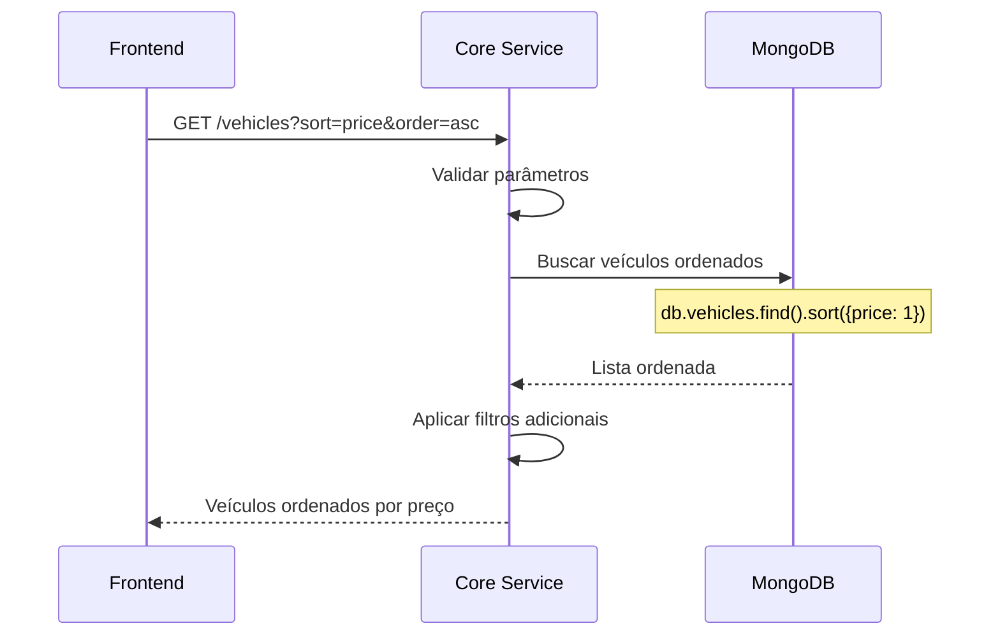

## Padrões Arquiteturais Utilizados

### 1. Arquitetura Hexagonal (Ports and Adapters)

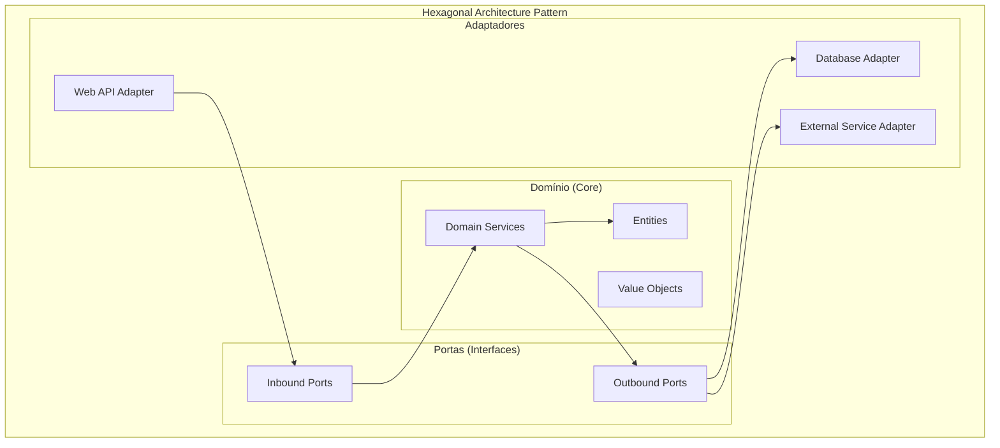

### 2. Repository Pattern

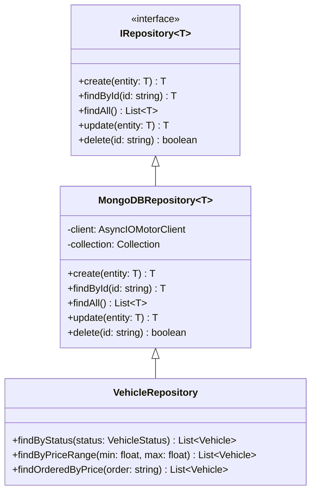

### 3. Service Layer Pattern

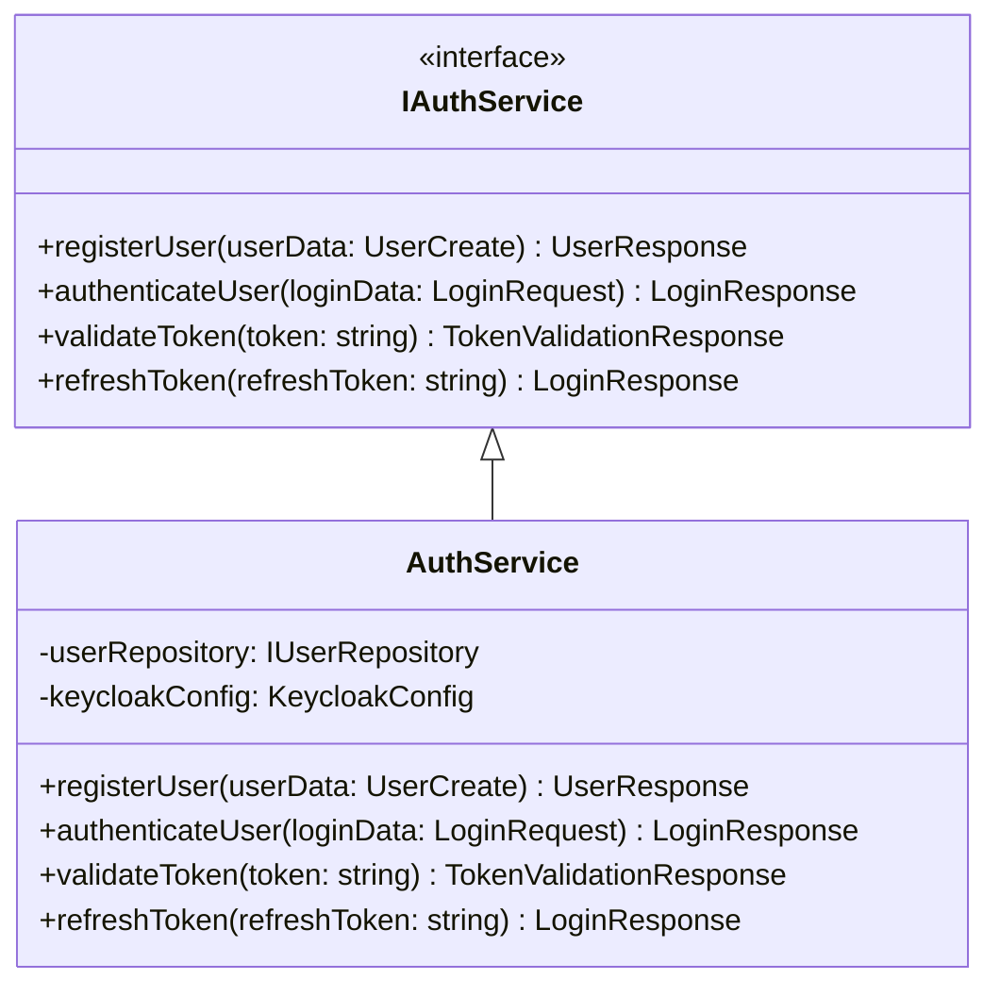

## Segurança

### Fluxo de Segurança

```mermaid
graph TB
    subgraph "Camada de Segurança"
        subgraph "Autenticação"
            KC[Keycloak IdP]
            JWT[JWT Tokens]
            OAUTH[OAuth 2.0 / OIDC]
        end
        
        subgraph "Autorização"
            RBAC[Role-Based Access Control]
            MIDDLEWARE[Auth Middleware]
            GUARDS[Route Guards]
        end
        
        subgraph "Validação"
            TOKENVAL[Token Validation]
            USERVAL[User Status Check]
            ROLECHECK[Role Verification]
        end
    end
    
    KC --> JWT
    JWT --> OAUTH
    OAUTH --> RBAC
    RBAC --> MIDDLEWARE
    MIDDLEWARE --> GUARDS
    GUARDS --> TOKENVAL
    TOKENVAL --> USERVAL
    USERVAL --> ROLECHECK
```

### Matriz de Permissões

| Endpoint | ADMIN | SALES | CUSTOMER |
|----------|-------|-------|----------|
| GET /vehicles | ✅ | ✅ | ✅ |
| POST /vehicles | ✅ | ✅ | ❌ |
| PUT /vehicles | ✅ | ✅ | ❌ |
| DELETE /vehicles | ✅ | ❌ | ❌ |
| GET /sales | ✅ | ✅ | ✅* |
| POST /sales | ✅ | ✅ | ✅ |
| GET /customers | ✅ | ✅ | ✅* |
| POST /customers | ✅ | ✅ | ✅ |
| GET /auth/users | ✅ | ❌ | ❌ |

*Apenas próprios dados

## Escalabilidade

### Estratégias de Escalabilidade

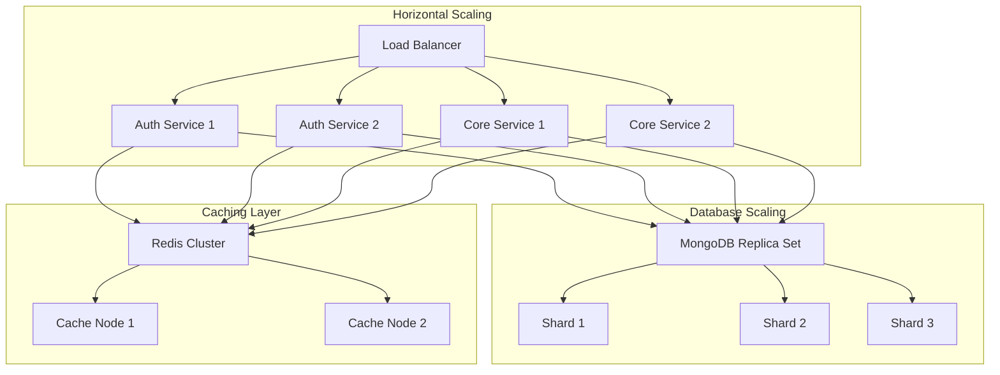

## Monitoramento e Observabilidade

### Stack de Monitoramento

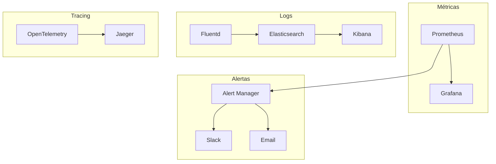

## Deployment

### Estratégia de Deployment

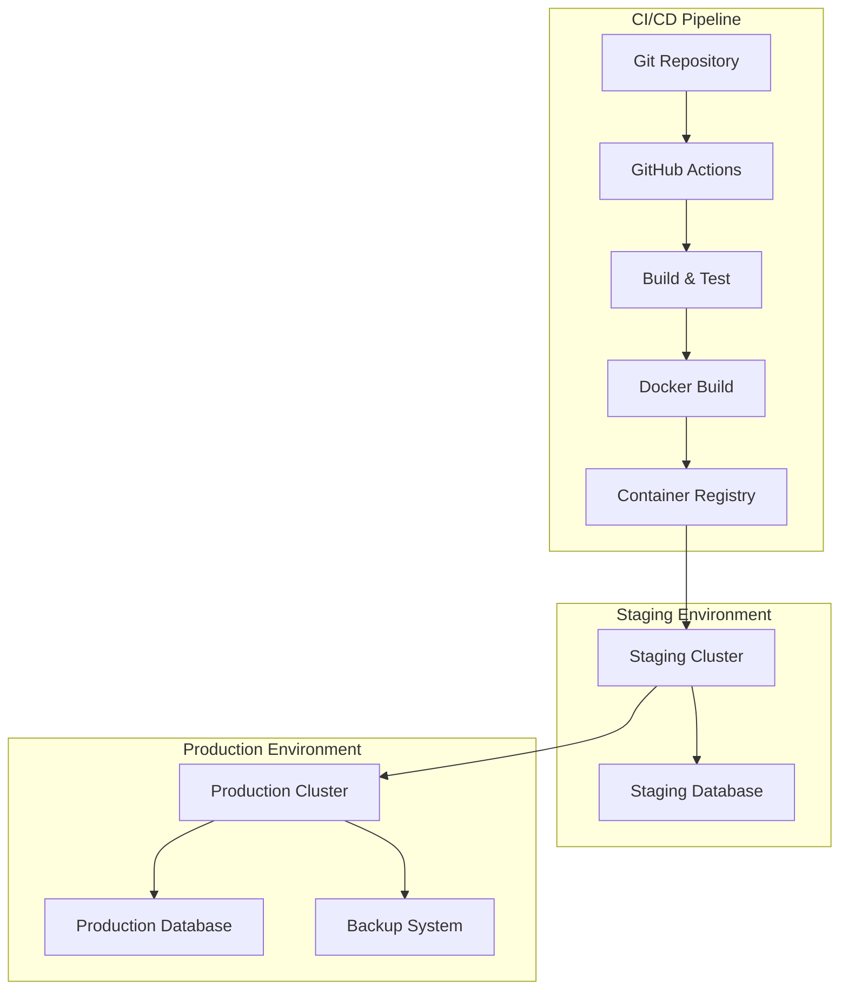

## Considerações de Performance

### Otimizações Implementadas

1. **Conexões Assíncronas**: Uso de Motor para MongoDB (async)
2. **Connection Pooling**: Pool de conexões para banco de dados
3. **Lazy Loading**: Carregamento sob demanda de dados relacionados
4. **Índices de Banco**: Índices otimizados para consultas frequentes
5. **Paginação**: Implementação de paginação em todas as listagens
6. **Validação de Entrada**: Validação usando Pydantic para performance

### Métricas de Performance Alvo

| Métrica | Valor Alvo |
|---------|------------|
| Response Time (API) | < 200ms |
| Database Query Time | < 50ms |
| Authentication Time | < 100ms |
| Throughput | > 1000 req/s |
| Availability | 99.9% |

## Próximos Passos Arquiteturais

1. **Implementação de Cache**: Redis para cache de sessões e dados frequentes
2. **Event Sourcing**: Para auditoria e histórico de mudanças
3. **CQRS**: Separação de comandos e consultas
4. **API Gateway**: Centralização de roteamento e políticas
5. **Service Mesh**: Istio para comunicação entre serviços
6. **Distributed Tracing**: Rastreamento distribuído completo 

## Visão Geral

O sistema de vendas de veículos foi projetado seguindo uma arquitetura de microsserviços, onde cada serviço tem responsabilidades específicas e bem definidas. A arquitetura segue os princípios da **Arquitetura Hexagonal** (Ports and Adapters), garantindo alta testabilidade, manutenibilidade e escalabilidade.

## Diagrama de Arquitetura Geral


## Arquitetura Hexagonal por Serviço

### Auth Service


### Core Service


## Fluxos de Dados

### Fluxo de Autenticação


### Fluxo de Compra de Veículo


### Fluxo de Ordenação de Veículos


## Padrões Arquiteturais Utilizados

### 1. Arquitetura Hexagonal (Ports and Adapters)


### 2. Repository Pattern

```mermaid
classDiagram
    class IRepository~T~ {
        <<interface>>
        +create(entity: T) T
        +findById(id: string) T
        +findAll() List~T~
        +update(entity: T) T
        +delete(id: string) boolean
    }
    
    class MongoDBRepository~T~ {
        -client: AsyncIOMotorClient
        -collection: Collection
        +create(entity: T) T
        +findById(id: string) T
        +findAll() List~T~
        +update(entity: T) T
        +delete(id: string) boolean
    }
    
    class VehicleRepository {
        +findByStatus(status: VehicleStatus) List~Vehicle~
        +findByPriceRange(min: float, max: float) List~Vehicle~
        +findOrderedByPrice(order: string) List~Vehicle~
    }
    
    IRepository~T~ <|-- MongoDBRepository~T~
    MongoDBRepository~T~ <|-- VehicleRepository
```

### 3. Service Layer Pattern

```mermaid
classDiagram
    class IAuthService {
        <<interface>>
        +registerUser(userData: UserCreate) UserResponse
        +authenticateUser(loginData: LoginRequest) LoginResponse
        +validateToken(token: string) TokenValidationResponse
        +refreshToken(refreshToken: string) LoginResponse
    }
    
    class AuthService {
        -userRepository: IUserRepository
        -keycloakConfig: KeycloakConfig
        +registerUser(userData: UserCreate) UserResponse
        +authenticateUser(loginData: LoginRequest) LoginResponse
        +validateToken(token: string) TokenValidationResponse
        +refreshToken(refreshToken: string) LoginResponse
    }
    
    IAuthService <|-- AuthService
```

## Segurança

### Fluxo de Segurança

```mermaid
graph TB
    subgraph "Camada de Segurança"
        subgraph "Autenticação"
            KC[Keycloak IdP]
            JWT[JWT Tokens]
            OAUTH[OAuth 2.0 / OIDC]
        end
        
        subgraph "Autorização"
            RBAC[Role-Based Access Control]
            MIDDLEWARE[Auth Middleware]
            GUARDS[Route Guards]
        end
        
        subgraph "Validação"
            TOKENVAL[Token Validation]
            USERVAL[User Status Check]
            ROLECHECK[Role Verification]
        end
    end
    
    KC --> JWT
    JWT --> OAUTH
    OAUTH --> RBAC
    RBAC --> MIDDLEWARE
    MIDDLEWARE --> GUARDS
    GUARDS --> TOKENVAL
    TOKENVAL --> USERVAL
    USERVAL --> ROLECHECK
```

### Matriz de Permissões

| Endpoint | ADMIN | SALES | CUSTOMER |
|----------|-------|-------|----------|
| GET /vehicles | ✅ | ✅ | ✅ |
| POST /vehicles | ✅ | ✅ | ❌ |
| PUT /vehicles | ✅ | ✅ | ❌ |
| DELETE /vehicles | ✅ | ❌ | ❌ |
| GET /sales | ✅ | ✅ | ✅* |
| POST /sales | ✅ | ✅ | ✅ |
| GET /customers | ✅ | ✅ | ✅* |
| POST /customers | ✅ | ✅ | ✅ |
| GET /auth/users | ✅ | ❌ | ❌ |

*Apenas próprios dados

## Escalabilidade

### Estratégias de Escalabilidade

```mermaid
graph TB
    subgraph "Horizontal Scaling"
        LB[Load Balancer]
        AUTH1[Auth Service 1]
        AUTH2[Auth Service 2]
        CORE1[Core Service 1]
        CORE2[Core Service 2]
    end
    
    subgraph "Database Scaling"
        MONGODB[MongoDB Replica Set]
        SHARD1[Shard 1]
        SHARD2[Shard 2]
        SHARD3[Shard 3]
    end
    
    subgraph "Caching Layer"
        REDIS[Redis Cluster]
        CACHE1[Cache Node 1]
        CACHE2[Cache Node 2]
    end
    
    LB --> AUTH1
    LB --> AUTH2
    LB --> CORE1
    LB --> CORE2
    
    AUTH1 --> MONGODB
    AUTH2 --> MONGODB
    CORE1 --> MONGODB
    CORE2 --> MONGODB
    
    MONGODB --> SHARD1
    MONGODB --> SHARD2
    MONGODB --> SHARD3
    
    AUTH1 --> REDIS
    AUTH2 --> REDIS
    CORE1 --> REDIS
    CORE2 --> REDIS
    
    REDIS --> CACHE1
    REDIS --> CACHE2
```

## Monitoramento e Observabilidade

### Stack de Monitoramento

```mermaid
graph TB
    subgraph "Métricas"
        PROMETHEUS[Prometheus]
        GRAFANA[Grafana]
    end
    
    subgraph "Logs"
        FLUENTD[Fluentd]
        ELASTICSEARCH[Elasticsearch]
        KIBANA[Kibana]
    end
    
    subgraph "Tracing"
        JAEGER[Jaeger]
        OPENTEL[OpenTelemetry]
    end
    
    subgraph "Alertas"
        ALERTMANAGER[Alert Manager]
        SLACK[Slack]
        EMAIL[Email]
    end
    
    PROMETHEUS --> GRAFANA
    FLUENTD --> ELASTICSEARCH
    ELASTICSEARCH --> KIBANA
    OPENTEL --> JAEGER
    PROMETHEUS --> ALERTMANAGER
    ALERTMANAGER --> SLACK
    ALERTMANAGER --> EMAIL
```

## Deployment

### Estratégia de Deployment

```mermaid
graph TB
    subgraph "CI/CD Pipeline"
        GIT[Git Repository]
        GITHUB[GitHub Actions]
        BUILD[Build & Test]
        DOCKER[Docker Build]
        REGISTRY[Container Registry]
    end
    
    subgraph "Staging Environment"
        STAGING[Staging Cluster]
        STAGINGDB[Staging Database]
    end
    
    subgraph "Production Environment"
        PROD[Production Cluster]
        PRODDB[Production Database]
        BACKUP[Backup System]
    end
    
    GIT --> GITHUB
    GITHUB --> BUILD
    BUILD --> DOCKER
    DOCKER --> REGISTRY
    REGISTRY --> STAGING
    STAGING --> STAGINGDB
    STAGING --> PROD
    PROD --> PRODDB
    PROD --> BACKUP
```

## Considerações de Performance

### Otimizações Implementadas

1. **Conexões Assíncronas**: Uso de Motor para MongoDB (async)
2. **Connection Pooling**: Pool de conexões para banco de dados
3. **Lazy Loading**: Carregamento sob demanda de dados relacionados
4. **Índices de Banco**: Índices otimizados para consultas frequentes
5. **Paginação**: Implementação de paginação em todas as listagens
6. **Validação de Entrada**: Validação usando Pydantic para performance

### Métricas de Performance Alvo

| Métrica | Valor Alvo |
|---------|------------|
| Response Time (API) | < 200ms |
| Database Query Time | < 50ms |
| Authentication Time | < 100ms |
| Throughput | > 1000 req/s |
| Availability | 99.9% |

## Próximos Passos Arquiteturais

1. **Implementação de Cache**: Redis para cache de sessões e dados frequentes
2. **Event Sourcing**: Para auditoria e histórico de mudanças
3. **CQRS**: Separação de comandos e consultas
4. **API Gateway**: Centralização de roteamento e políticas
5. **Service Mesh**: Istio para comunicação entre serviços
6. **Distributed Tracing**: Rastreamento distribuído completo 

## Visão Geral

O sistema de vendas de veículos foi projetado seguindo uma arquitetura de microsserviços, onde cada serviço tem responsabilidades específicas e bem definidas. A arquitetura segue os princípios da **Arquitetura Hexagonal** (Ports and Adapters), garantindo alta testabilidade, manutenibilidade e escalabilidade.

## Diagrama de Arquitetura Geral

```mermaid
graph TB
    subgraph "Camada de Apresentação"
        UI[Frontend React<br/>Port: 3000]
        SWAGGER[Swagger UI<br/>Documentação APIs]
    end
    
    subgraph "Camada de API Gateway"
        NGINX[NGINX/Load Balancer<br/>Port: 80]
        CORS[CORS Middleware]
    end
    
    subgraph "Camada de Microsserviços"
        AUTH[Auth Service<br/>Port: 8002<br/>Autenticação/Autorização]
        CORE[Core Service<br/>Port: 8000<br/>Gestão de Veículos]
        SALES[Sales Service<br/>Port: 8001<br/>Processo de Vendas]
        CUSTOMER[Customer Service<br/>Port: 8003<br/>Gestão de Clientes]
    end
    
    subgraph "Camada de Identidade"
        KC[Keycloak<br/>Port: 8080<br/>Identity Provider]
    end
    
    subgraph "Camada de Dados"
        AUTHDB[(Auth MongoDB<br/>Port: 27021<br/>Usuários)]
        COREDB[(Core MongoDB<br/>Port: 27019<br/>Veículos)]
        SALESDB[(Sales MongoDB<br/>Port: 27020<br/>Vendas)]
        CUSTOMERDB[(Customer MongoDB<br/>Port: 27022<br/>Clientes)]
    end
    
    subgraph "Camada de Infraestrutura"
        DOCKER[Docker Containers]
        NETWORK[Docker Network]
        VOLUMES[Docker Volumes]
    end
    
    UI --> NGINX
    SWAGGER --> NGINX
    NGINX --> AUTH
    NGINX --> CORE
    NGINX --> SALES
    NGINX --> CUSTOMER
    
    AUTH --> KC
    AUTH --> AUTHDB
    CORE --> COREDB
    SALES --> SALESDB
    CUSTOMER --> CUSTOMERDB
    
    SALES --> CORE
    SALES --> CUSTOMER
    CORE --> AUTH
    SALES --> AUTH
    CUSTOMER --> AUTH
    
    AUTH -.-> DOCKER
    CORE -.-> DOCKER
    SALES -.-> DOCKER
    CUSTOMER -.-> DOCKER
    KC -.-> DOCKER
    
    AUTHDB -.-> VOLUMES
    COREDB -.-> VOLUMES
    SALESDB -.-> VOLUMES
    CUSTOMERDB -.-> VOLUMES
```

## Arquitetura Hexagonal por Serviço

### Auth Service

```mermaid
graph TB
    subgraph "Auth Service - Arquitetura Hexagonal"
        subgraph "Domínio"
            USER[User Entity]
            USEROLE[UserRole Enum]
            USTATUS[UserStatus Enum]
        end
        
        subgraph "Portas (Interfaces)"
            IAUTH[IAuthService]
            IUSERREPO[IUserRepository]
            IKEYCLOAK[IKeycloakAdapter]
        end
        
        subgraph "Adaptadores Primários"
            AUTHCTL[AuthController]
            MIDDLEWARE[AuthMiddleware]
            FASTAPI[FastAPI Routes]
        end
        
        subgraph "Adaptadores Secundários"
            MONGOREPO[MongoDBUserRepository]
            KCADAPTER[KeycloakAdapter]
        end
        
        subgraph "Infraestrutura"
            MONGODB[(MongoDB)]
            KEYCLOAK[Keycloak]
        end
    end
    
    FASTAPI --> AUTHCTL
    AUTHCTL --> IAUTH
    IAUTH --> USER
    IAUTH --> IUSERREPO
    IAUTH --> IKEYCLOAK
    IUSERREPO --> MONGOREPO
    IKEYCLOAK --> KCADAPTER
    MONGOREPO --> MONGODB
    KCADAPTER --> KEYCLOAK
```

### Core Service

```mermaid
graph TB
    subgraph "Core Service - Arquitetura Hexagonal"
        subgraph "Domínio"
            VEHICLE[Vehicle Entity]
            VSTATUS[VehicleStatus Enum]
            VTYPE[VehicleType Enum]
        end
        
        subgraph "Portas (Interfaces)"
            IVEHICLE[IVehicleService]
            IVREPO[IVehicleRepository]
            IAUTH[IAuthAdapter]
        end
        
        subgraph "Adaptadores Primários"
            VCTL[VehicleController]
            FASTAPI[FastAPI Routes]
        end
        
        subgraph "Adaptadores Secundários"
            MONGOREPO[MongoDBVehicleRepository]
            AUTHCLIENT[AuthServiceClient]
        end
        
        subgraph "Infraestrutura"
            MONGODB[(MongoDB)]
            AUTHSVC[Auth Service]
        end
    end
    
    FASTAPI --> VCTL
    VCTL --> IVEHICLE
    IVEHICLE --> VEHICLE
    IVEHICLE --> IVREPO
    IVEHICLE --> IAUTH
    IVREPO --> MONGOREPO
    IAUTH --> AUTHCLIENT
    MONGOREPO --> MONGODB
    AUTHCLIENT --> AUTHSVC
```

## Fluxos de Dados

### Fluxo de Autenticação

```mermaid
sequenceDiagram
    participant C as Cliente
    participant F as Frontend
    participant A as Auth Service
    participant K as Keycloak
    participant M as MongoDB
    
    C->>F: Login (email/senha)
    F->>A: POST /auth/login
    A->>M: Buscar usuário por email
    M-->>A: Dados do usuário
    A->>K: Autenticar no Keycloak
    K-->>A: Tokens JWT
    A->>M: Atualizar último login
    A-->>F: Access + Refresh Token
    F-->>C: Login realizado
    
    Note over C,M: Fluxo de Validação de Token
    C->>F: Requisição autenticada
    F->>A: Validar token
    A->>K: Introspect token
    K-->>A: Token válido + claims
    A->>M: Verificar status do usuário
    M-->>A: Usuário ativo
    A-->>F: Token válido
    F-->>C: Resposta autorizada
```

### Fluxo de Compra de Veículo

```mermaid
sequenceDiagram
    participant C as Cliente
    participant F as Frontend
    participant S as Sales Service
    participant CR as Core Service
    participant CS as Customer Service
    participant A as Auth Service
    
    C->>F: Selecionar veículo
    F->>S: POST /sales/purchase
    S->>A: Validar token
    A-->>S: Token válido
    S->>CR: GET /vehicles/{id}
    CR-->>S: Dados do veículo
    S->>CS: GET /customers/{id}
    CS-->>S: Dados do cliente
    S->>S: Processar compra
    S->>CR: PUT /vehicles/{id} (status=sold)
    CR-->>S: Veículo atualizado
    S->>S: Criar registro de venda
    S-->>F: Compra processada
    F-->>C: Confirmação
```

### Fluxo de Ordenação de Veículos

```mermaid
sequenceDiagram
    participant F as Frontend
    participant C as Core Service
    participant M as MongoDB
    
    F->>C: GET /vehicles?sort=price&order=asc
    C->>C: Validar parâmetros
    C->>M: Buscar veículos ordenados
    Note over M: db.vehicles.find().sort({price: 1})
    M-->>C: Lista ordenada
    C->>C: Aplicar filtros adicionais
    C-->>F: Veículos ordenados por preço
```

## Padrões Arquiteturais Utilizados

### 1. Arquitetura Hexagonal (Ports and Adapters)

```mermaid
graph TB
    subgraph "Hexagonal Architecture Pattern"
        subgraph "Domínio (Core)"
            ENTITIES[Entities]
            VALUEOBJECTS[Value Objects]
            SERVICES[Domain Services]
        end
        
        subgraph "Portas (Interfaces)"
            INBOUND[Inbound Ports]
            OUTBOUND[Outbound Ports]
        end
        
        subgraph "Adaptadores"
            WEBAPI[Web API Adapter]
            DBADAPTER[Database Adapter]
            EXTSERVICE[External Service Adapter]
        end
    end
    
    WEBAPI --> INBOUND
    INBOUND --> SERVICES
    SERVICES --> ENTITIES
    SERVICES --> OUTBOUND
    OUTBOUND --> DBADAPTER
    OUTBOUND --> EXTSERVICE
```

### 2. Repository Pattern

```mermaid
classDiagram
    class IRepository~T~ {
        <<interface>>
        +create(entity: T) T
        +findById(id: string) T
        +findAll() List~T~
        +update(entity: T) T
        +delete(id: string) boolean
    }
    
    class MongoDBRepository~T~ {
        -client: AsyncIOMotorClient
        -collection: Collection
        +create(entity: T) T
        +findById(id: string) T
        +findAll() List~T~
        +update(entity: T) T
        +delete(id: string) boolean
    }
    
    class VehicleRepository {
        +findByStatus(status: VehicleStatus) List~Vehicle~
        +findByPriceRange(min: float, max: float) List~Vehicle~
        +findOrderedByPrice(order: string) List~Vehicle~
    }
    
    IRepository~T~ <|-- MongoDBRepository~T~
    MongoDBRepository~T~ <|-- VehicleRepository
```

### 3. Service Layer Pattern

```mermaid
classDiagram
    class IAuthService {
        <<interface>>
        +registerUser(userData: UserCreate) UserResponse
        +authenticateUser(loginData: LoginRequest) LoginResponse
        +validateToken(token: string) TokenValidationResponse
        +refreshToken(refreshToken: string) LoginResponse
    }
    
    class AuthService {
        -userRepository: IUserRepository
        -keycloakConfig: KeycloakConfig
        +registerUser(userData: UserCreate) UserResponse
        +authenticateUser(loginData: LoginRequest) LoginResponse
        +validateToken(token: string) TokenValidationResponse
        +refreshToken(refreshToken: string) LoginResponse
    }
    
    IAuthService <|-- AuthService
```

## Segurança

### Fluxo de Segurança

```mermaid
graph TB
    subgraph "Camada de Segurança"
        subgraph "Autenticação"
            KC[Keycloak IdP]
            JWT[JWT Tokens]
            OAUTH[OAuth 2.0 / OIDC]
        end
        
        subgraph "Autorização"
            RBAC[Role-Based Access Control]
            MIDDLEWARE[Auth Middleware]
            GUARDS[Route Guards]
        end
        
        subgraph "Validação"
            TOKENVAL[Token Validation]
            USERVAL[User Status Check]
            ROLECHECK[Role Verification]
        end
    end
    
    KC --> JWT
    JWT --> OAUTH
    OAUTH --> RBAC
    RBAC --> MIDDLEWARE
    MIDDLEWARE --> GUARDS
    GUARDS --> TOKENVAL
    TOKENVAL --> USERVAL
    USERVAL --> ROLECHECK
```

### Matriz de Permissões

| Endpoint | ADMIN | SALES | CUSTOMER |
|----------|-------|-------|----------|
| GET /vehicles | ✅ | ✅ | ✅ |
| POST /vehicles | ✅ | ✅ | ❌ |
| PUT /vehicles | ✅ | ✅ | ❌ |
| DELETE /vehicles | ✅ | ❌ | ❌ |
| GET /sales | ✅ | ✅ | ✅* |
| POST /sales | ✅ | ✅ | ✅ |
| GET /customers | ✅ | ✅ | ✅* |
| POST /customers | ✅ | ✅ | ✅ |
| GET /auth/users | ✅ | ❌ | ❌ |

*Apenas próprios dados

## Escalabilidade

### Estratégias de Escalabilidade

```mermaid
graph TB
    subgraph "Horizontal Scaling"
        LB[Load Balancer]
        AUTH1[Auth Service 1]
        AUTH2[Auth Service 2]
        CORE1[Core Service 1]
        CORE2[Core Service 2]
    end
    
    subgraph "Database Scaling"
        MONGODB[MongoDB Replica Set]
        SHARD1[Shard 1]
        SHARD2[Shard 2]
        SHARD3[Shard 3]
    end
    
    subgraph "Caching Layer"
        REDIS[Redis Cluster]
        CACHE1[Cache Node 1]
        CACHE2[Cache Node 2]
    end
    
    LB --> AUTH1
    LB --> AUTH2
    LB --> CORE1
    LB --> CORE2
    
    AUTH1 --> MONGODB
    AUTH2 --> MONGODB
    CORE1 --> MONGODB
    CORE2 --> MONGODB
    
    MONGODB --> SHARD1
    MONGODB --> SHARD2
    MONGODB --> SHARD3
    
    AUTH1 --> REDIS
    AUTH2 --> REDIS
    CORE1 --> REDIS
    CORE2 --> REDIS
    
    REDIS --> CACHE1
    REDIS --> CACHE2
```

## Monitoramento e Observabilidade

### Stack de Monitoramento

```mermaid
graph TB
    subgraph "Métricas"
        PROMETHEUS[Prometheus]
        GRAFANA[Grafana]
    end
    
    subgraph "Logs"
        FLUENTD[Fluentd]
        ELASTICSEARCH[Elasticsearch]
        KIBANA[Kibana]
    end
    
    subgraph "Tracing"
        JAEGER[Jaeger]
        OPENTEL[OpenTelemetry]
    end
    
    subgraph "Alertas"
        ALERTMANAGER[Alert Manager]
        SLACK[Slack]
        EMAIL[Email]
    end
    
    PROMETHEUS --> GRAFANA
    FLUENTD --> ELASTICSEARCH
    ELASTICSEARCH --> KIBANA
    OPENTEL --> JAEGER
    PROMETHEUS --> ALERTMANAGER
    ALERTMANAGER --> SLACK
    ALERTMANAGER --> EMAIL
```

## Deployment

### Estratégia de Deployment

```mermaid
graph TB
    subgraph "CI/CD Pipeline"
        GIT[Git Repository]
        GITHUB[GitHub Actions]
        BUILD[Build & Test]
        DOCKER[Docker Build]
        REGISTRY[Container Registry]
    end
    
    subgraph "Staging Environment"
        STAGING[Staging Cluster]
        STAGINGDB[Staging Database]
    end
    
    subgraph "Production Environment"
        PROD[Production Cluster]
        PRODDB[Production Database]
        BACKUP[Backup System]
    end
    
    GIT --> GITHUB
    GITHUB --> BUILD
    BUILD --> DOCKER
    DOCKER --> REGISTRY
    REGISTRY --> STAGING
    STAGING --> STAGINGDB
    STAGING --> PROD
    PROD --> PRODDB
    PROD --> BACKUP
```

## Considerações de Performance

### Otimizações Implementadas

1. **Conexões Assíncronas**: Uso de Motor para MongoDB (async)
2. **Connection Pooling**: Pool de conexões para banco de dados
3. **Lazy Loading**: Carregamento sob demanda de dados relacionados
4. **Índices de Banco**: Índices otimizados para consultas frequentes
5. **Paginação**: Implementação de paginação em todas as listagens
6. **Validação de Entrada**: Validação usando Pydantic para performance

### Métricas de Performance Alvo

| Métrica | Valor Alvo |
|---------|------------|
| Response Time (API) | < 200ms |
| Database Query Time | < 50ms |
| Authentication Time | < 100ms |
| Throughput | > 1000 req/s |
| Availability | 99.9% |

## Próximos Passos Arquiteturais

1. **Implementação de Cache**: Redis para cache de sessões e dados frequentes
2. **Event Sourcing**: Para auditoria e histórico de mudanças
3. **CQRS**: Separação de comandos e consultas
4. **API Gateway**: Centralização de roteamento e políticas
5. **Service Mesh**: Istio para comunicação entre serviços
6. **Distributed Tracing**: Rastreamento distribuído completo 

## Visão Geral

O sistema de vendas de veículos foi projetado seguindo uma arquitetura de microsserviços, onde cada serviço tem responsabilidades específicas e bem definidas. A arquitetura segue os princípios da **Arquitetura Hexagonal** (Ports and Adapters), garantindo alta testabilidade, manutenibilidade e escalabilidade.

## Diagrama de Arquitetura Geral

```mermaid
graph TB
    subgraph "Camada de Apresentação"
        UI[Frontend React<br/>Port: 3000]
        SWAGGER[Swagger UI<br/>Documentação APIs]
    end
    
    subgraph "Camada de API Gateway"
        NGINX[NGINX/Load Balancer<br/>Port: 80]
        CORS[CORS Middleware]
    end
    
    subgraph "Camada de Microsserviços"
        AUTH[Auth Service<br/>Port: 8002<br/>Autenticação/Autorização]
        CORE[Core Service<br/>Port: 8000<br/>Gestão de Veículos]
        SALES[Sales Service<br/>Port: 8001<br/>Processo de Vendas]
        CUSTOMER[Customer Service<br/>Port: 8003<br/>Gestão de Clientes]
    end
    
    subgraph "Camada de Identidade"
        KC[Keycloak<br/>Port: 8080<br/>Identity Provider]
    end
    
    subgraph "Camada de Dados"
        AUTHDB[(Auth MongoDB<br/>Port: 27021<br/>Usuários)]
        COREDB[(Core MongoDB<br/>Port: 27019<br/>Veículos)]
        SALESDB[(Sales MongoDB<br/>Port: 27020<br/>Vendas)]
        CUSTOMERDB[(Customer MongoDB<br/>Port: 27022<br/>Clientes)]
    end
    
    subgraph "Camada de Infraestrutura"
        DOCKER[Docker Containers]
        NETWORK[Docker Network]
        VOLUMES[Docker Volumes]
    end
    
    UI --> NGINX
    SWAGGER --> NGINX
    NGINX --> AUTH
    NGINX --> CORE
    NGINX --> SALES
    NGINX --> CUSTOMER
    
    AUTH --> KC
    AUTH --> AUTHDB
    CORE --> COREDB
    SALES --> SALESDB
    CUSTOMER --> CUSTOMERDB
    
    SALES --> CORE
    SALES --> CUSTOMER
    CORE --> AUTH
    SALES --> AUTH
    CUSTOMER --> AUTH
    
    AUTH -.-> DOCKER
    CORE -.-> DOCKER
    SALES -.-> DOCKER
    CUSTOMER -.-> DOCKER
    KC -.-> DOCKER
    
    AUTHDB -.-> VOLUMES
    COREDB -.-> VOLUMES
    SALESDB -.-> VOLUMES
    CUSTOMERDB -.-> VOLUMES
```

## Arquitetura Hexagonal por Serviço

### Auth Service

```mermaid
graph TB
    subgraph "Auth Service - Arquitetura Hexagonal"
        subgraph "Domínio"
            USER[User Entity]
            USEROLE[UserRole Enum]
            USTATUS[UserStatus Enum]
        end
        
        subgraph "Portas (Interfaces)"
            IAUTH[IAuthService]
            IUSERREPO[IUserRepository]
            IKEYCLOAK[IKeycloakAdapter]
        end
        
        subgraph "Adaptadores Primários"
            AUTHCTL[AuthController]
            MIDDLEWARE[AuthMiddleware]
            FASTAPI[FastAPI Routes]
        end
        
        subgraph "Adaptadores Secundários"
            MONGOREPO[MongoDBUserRepository]
            KCADAPTER[KeycloakAdapter]
        end
        
        subgraph "Infraestrutura"
            MONGODB[(MongoDB)]
            KEYCLOAK[Keycloak]
        end
    end
    
    FASTAPI --> AUTHCTL
    AUTHCTL --> IAUTH
    IAUTH --> USER
    IAUTH --> IUSERREPO
    IAUTH --> IKEYCLOAK
    IUSERREPO --> MONGOREPO
    IKEYCLOAK --> KCADAPTER
    MONGOREPO --> MONGODB
    KCADAPTER --> KEYCLOAK
```

### Core Service

```mermaid
graph TB
    subgraph "Core Service - Arquitetura Hexagonal"
        subgraph "Domínio"
            VEHICLE[Vehicle Entity]
            VSTATUS[VehicleStatus Enum]
            VTYPE[VehicleType Enum]
        end
        
        subgraph "Portas (Interfaces)"
            IVEHICLE[IVehicleService]
            IVREPO[IVehicleRepository]
            IAUTH[IAuthAdapter]
        end
        
        subgraph "Adaptadores Primários"
            VCTL[VehicleController]
            FASTAPI[FastAPI Routes]
        end
        
        subgraph "Adaptadores Secundários"
            MONGOREPO[MongoDBVehicleRepository]
            AUTHCLIENT[AuthServiceClient]
        end
        
        subgraph "Infraestrutura"
            MONGODB[(MongoDB)]
            AUTHSVC[Auth Service]
        end
    end
    
    FASTAPI --> VCTL
    VCTL --> IVEHICLE
    IVEHICLE --> VEHICLE
    IVEHICLE --> IVREPO
    IVEHICLE --> IAUTH
    IVREPO --> MONGOREPO
    IAUTH --> AUTHCLIENT
    MONGOREPO --> MONGODB
    AUTHCLIENT --> AUTHSVC
```

## Fluxos de Dados

### Fluxo de Autenticação

```mermaid
sequenceDiagram
    participant C as Cliente
    participant F as Frontend
    participant A as Auth Service
    participant K as Keycloak
    participant M as MongoDB
    
    C->>F: Login (email/senha)
    F->>A: POST /auth/login
    A->>M: Buscar usuário por email
    M-->>A: Dados do usuário
    A->>K: Autenticar no Keycloak
    K-->>A: Tokens JWT
    A->>M: Atualizar último login
    A-->>F: Access + Refresh Token
    F-->>C: Login realizado
    
    Note over C,M: Fluxo de Validação de Token
    C->>F: Requisição autenticada
    F->>A: Validar token
    A->>K: Introspect token
    K-->>A: Token válido + claims
    A->>M: Verificar status do usuário
    M-->>A: Usuário ativo
    A-->>F: Token válido
    F-->>C: Resposta autorizada
```

### Fluxo de Compra de Veículo

```mermaid
sequenceDiagram
    participant C as Cliente
    participant F as Frontend
    participant S as Sales Service
    participant CR as Core Service
    participant CS as Customer Service
    participant A as Auth Service
    
    C->>F: Selecionar veículo
    F->>S: POST /sales/purchase
    S->>A: Validar token
    A-->>S: Token válido
    S->>CR: GET /vehicles/{id}
    CR-->>S: Dados do veículo
    S->>CS: GET /customers/{id}
    CS-->>S: Dados do cliente
    S->>S: Processar compra
    S->>CR: PUT /vehicles/{id} (status=sold)
    CR-->>S: Veículo atualizado
    S->>S: Criar registro de venda
    S-->>F: Compra processada
    F-->>C: Confirmação
```

### Fluxo de Ordenação de Veículos

```mermaid
sequenceDiagram
    participant F as Frontend
    participant C as Core Service
    participant M as MongoDB
    
    F->>C: GET /vehicles?sort=price&order=asc
    C->>C: Validar parâmetros
    C->>M: Buscar veículos ordenados
    Note over M: db.vehicles.find().sort({price: 1})
    M-->>C: Lista ordenada
    C->>C: Aplicar filtros adicionais
    C-->>F: Veículos ordenados por preço
```

## Padrões Arquiteturais Utilizados

### 1. Arquitetura Hexagonal (Ports and Adapters)

```mermaid
graph TB
    subgraph "Hexagonal Architecture Pattern"
        subgraph "Domínio (Core)"
            ENTITIES[Entities]
            VALUEOBJECTS[Value Objects]
            SERVICES[Domain Services]
        end
        
        subgraph "Portas (Interfaces)"
            INBOUND[Inbound Ports]
            OUTBOUND[Outbound Ports]
        end
        
        subgraph "Adaptadores"
            WEBAPI[Web API Adapter]
            DBADAPTER[Database Adapter]
            EXTSERVICE[External Service Adapter]
        end
    end
    
    WEBAPI --> INBOUND
    INBOUND --> SERVICES
    SERVICES --> ENTITIES
    SERVICES --> OUTBOUND
    OUTBOUND --> DBADAPTER
    OUTBOUND --> EXTSERVICE
```

### 2. Repository Pattern

```mermaid
classDiagram
    class IRepository~T~ {
        <<interface>>
        +create(entity: T) T
        +findById(id: string) T
        +findAll() List~T~
        +update(entity: T) T
        +delete(id: string) boolean
    }
    
    class MongoDBRepository~T~ {
        -client: AsyncIOMotorClient
        -collection: Collection
        +create(entity: T) T
        +findById(id: string) T
        +findAll() List~T~
        +update(entity: T) T
        +delete(id: string) boolean
    }
    
    class VehicleRepository {
        +findByStatus(status: VehicleStatus) List~Vehicle~
        +findByPriceRange(min: float, max: float) List~Vehicle~
        +findOrderedByPrice(order: string) List~Vehicle~
    }
    
    IRepository~T~ <|-- MongoDBRepository~T~
    MongoDBRepository~T~ <|-- VehicleRepository
```

### 3. Service Layer Pattern

```mermaid
classDiagram
    class IAuthService {
        <<interface>>
        +registerUser(userData: UserCreate) UserResponse
        +authenticateUser(loginData: LoginRequest) LoginResponse
        +validateToken(token: string) TokenValidationResponse
        +refreshToken(refreshToken: string) LoginResponse
    }
    
    class AuthService {
        -userRepository: IUserRepository
        -keycloakConfig: KeycloakConfig
        +registerUser(userData: UserCreate) UserResponse
        +authenticateUser(loginData: LoginRequest) LoginResponse
        +validateToken(token: string) TokenValidationResponse
        +refreshToken(refreshToken: string) LoginResponse
    }
    
    IAuthService <|-- AuthService
```

## Segurança

### Fluxo de Segurança

```mermaid
graph TB
    subgraph "Camada de Segurança"
        subgraph "Autenticação"
            KC[Keycloak IdP]
            JWT[JWT Tokens]
            OAUTH[OAuth 2.0 / OIDC]
        end
        
        subgraph "Autorização"
            RBAC[Role-Based Access Control]
            MIDDLEWARE[Auth Middleware]
            GUARDS[Route Guards]
        end
        
        subgraph "Validação"
            TOKENVAL[Token Validation]
            USERVAL[User Status Check]
            ROLECHECK[Role Verification]
        end
    end
    
    KC --> JWT
    JWT --> OAUTH
    OAUTH --> RBAC
    RBAC --> MIDDLEWARE
    MIDDLEWARE --> GUARDS
    GUARDS --> TOKENVAL
    TOKENVAL --> USERVAL
    USERVAL --> ROLECHECK
```

### Matriz de Permissões

| Endpoint | ADMIN | SALES | CUSTOMER |
|----------|-------|-------|----------|
| GET /vehicles | ✅ | ✅ | ✅ |
| POST /vehicles | ✅ | ✅ | ❌ |
| PUT /vehicles | ✅ | ✅ | ❌ |
| DELETE /vehicles | ✅ | ❌ | ❌ |
| GET /sales | ✅ | ✅ | ✅* |
| POST /sales | ✅ | ✅ | ✅ |
| GET /customers | ✅ | ✅ | ✅* |
| POST /customers | ✅ | ✅ | ✅ |
| GET /auth/users | ✅ | ❌ | ❌ |

*Apenas próprios dados

## Escalabilidade

### Estratégias de Escalabilidade

```mermaid
graph TB
    subgraph "Horizontal Scaling"
        LB[Load Balancer]
        AUTH1[Auth Service 1]
        AUTH2[Auth Service 2]
        CORE1[Core Service 1]
        CORE2[Core Service 2]
    end
    
    subgraph "Database Scaling"
        MONGODB[MongoDB Replica Set]
        SHARD1[Shard 1]
        SHARD2[Shard 2]
        SHARD3[Shard 3]
    end
    
    subgraph "Caching Layer"
        REDIS[Redis Cluster]
        CACHE1[Cache Node 1]
        CACHE2[Cache Node 2]
    end
    
    LB --> AUTH1
    LB --> AUTH2
    LB --> CORE1
    LB --> CORE2
    
    AUTH1 --> MONGODB
    AUTH2 --> MONGODB
    CORE1 --> MONGODB
    CORE2 --> MONGODB
    
    MONGODB --> SHARD1
    MONGODB --> SHARD2
    MONGODB --> SHARD3
    
    AUTH1 --> REDIS
    AUTH2 --> REDIS
    CORE1 --> REDIS
    CORE2 --> REDIS
    
    REDIS --> CACHE1
    REDIS --> CACHE2
```

## Monitoramento e Observabilidade

### Stack de Monitoramento

```mermaid
graph TB
    subgraph "Métricas"
        PROMETHEUS[Prometheus]
        GRAFANA[Grafana]
    end
    
    subgraph "Logs"
        FLUENTD[Fluentd]
        ELASTICSEARCH[Elasticsearch]
        KIBANA[Kibana]
    end
    
    subgraph "Tracing"
        JAEGER[Jaeger]
        OPENTEL[OpenTelemetry]
    end
    
    subgraph "Alertas"
        ALERTMANAGER[Alert Manager]
        SLACK[Slack]
        EMAIL[Email]
    end
    
    PROMETHEUS --> GRAFANA
    FLUENTD --> ELASTICSEARCH
    ELASTICSEARCH --> KIBANA
    OPENTEL --> JAEGER
    PROMETHEUS --> ALERTMANAGER
    ALERTMANAGER --> SLACK
    ALERTMANAGER --> EMAIL
```

## Deployment

### Estratégia de Deployment

```mermaid
graph TB
    subgraph "CI/CD Pipeline"
        GIT[Git Repository]
        GITHUB[GitHub Actions]
        BUILD[Build & Test]
        DOCKER[Docker Build]
        REGISTRY[Container Registry]
    end
    
    subgraph "Staging Environment"
        STAGING[Staging Cluster]
        STAGINGDB[Staging Database]
    end
    
    subgraph "Production Environment"
        PROD[Production Cluster]
        PRODDB[Production Database]
        BACKUP[Backup System]
    end
    
    GIT --> GITHUB
    GITHUB --> BUILD
    BUILD --> DOCKER
    DOCKER --> REGISTRY
    REGISTRY --> STAGING
    STAGING --> STAGINGDB
    STAGING --> PROD
    PROD --> PRODDB
    PROD --> BACKUP
```

## Considerações de Performance

### Otimizações Implementadas

1. **Conexões Assíncronas**: Uso de Motor para MongoDB (async)
2. **Connection Pooling**: Pool de conexões para banco de dados
3. **Lazy Loading**: Carregamento sob demanda de dados relacionados
4. **Índices de Banco**: Índices otimizados para consultas frequentes
5. **Paginação**: Implementação de paginação em todas as listagens
6. **Validação de Entrada**: Validação usando Pydantic para performance

### Métricas de Performance Alvo

| Métrica | Valor Alvo |
|---------|------------|
| Response Time (API) | < 200ms |
| Database Query Time | < 50ms |
| Authentication Time | < 100ms |
| Throughput | > 1000 req/s |
| Availability | 99.9% |

## Próximos Passos Arquiteturais

1. **Implementação de Cache**: Redis para cache de sessões e dados frequentes
2. **Event Sourcing**: Para auditoria e histórico de mudanças
3. **CQRS**: Separação de comandos e consultas
4. **API Gateway**: Centralização de roteamento e políticas
5. **Service Mesh**: Istio para comunicação entre serviços
6. **Distributed Tracing**: Rastreamento distribuído completo 

## Visão Geral

O sistema de vendas de veículos foi projetado seguindo uma arquitetura de microsserviços, onde cada serviço tem responsabilidades específicas e bem definidas. A arquitetura segue os princípios da **Arquitetura Hexagonal** (Ports and Adapters), garantindo alta testabilidade, manutenibilidade e escalabilidade.

## Diagrama de Arquitetura Geral

```mermaid
graph TB
    subgraph "Camada de Apresentação"
        UI[Frontend React<br/>Port: 3000]
        SWAGGER[Swagger UI<br/>Documentação APIs]
    end
    
    subgraph "Camada de API Gateway"
        NGINX[NGINX/Load Balancer<br/>Port: 80]
        CORS[CORS Middleware]
    end
    
    subgraph "Camada de Microsserviços"
        AUTH[Auth Service<br/>Port: 8002<br/>Autenticação/Autorização]
        CORE[Core Service<br/>Port: 8000<br/>Gestão de Veículos]
        SALES[Sales Service<br/>Port: 8001<br/>Processo de Vendas]
        CUSTOMER[Customer Service<br/>Port: 8003<br/>Gestão de Clientes]
    end
    
    subgraph "Camada de Identidade"
        KC[Keycloak<br/>Port: 8080<br/>Identity Provider]
    end
    
    subgraph "Camada de Dados"
        AUTHDB[(Auth MongoDB<br/>Port: 27021<br/>Usuários)]
        COREDB[(Core MongoDB<br/>Port: 27019<br/>Veículos)]
        SALESDB[(Sales MongoDB<br/>Port: 27020<br/>Vendas)]
        CUSTOMERDB[(Customer MongoDB<br/>Port: 27022<br/>Clientes)]
    end
    
    subgraph "Camada de Infraestrutura"
        DOCKER[Docker Containers]
        NETWORK[Docker Network]
        VOLUMES[Docker Volumes]
    end
    
    UI --> NGINX
    SWAGGER --> NGINX
    NGINX --> AUTH
    NGINX --> CORE
    NGINX --> SALES
    NGINX --> CUSTOMER
    
    AUTH --> KC
    AUTH --> AUTHDB
    CORE --> COREDB
    SALES --> SALESDB
    CUSTOMER --> CUSTOMERDB
    
    SALES --> CORE
    SALES --> CUSTOMER
    CORE --> AUTH
    SALES --> AUTH
    CUSTOMER --> AUTH
    
    AUTH -.-> DOCKER
    CORE -.-> DOCKER
    SALES -.-> DOCKER
    CUSTOMER -.-> DOCKER
    KC -.-> DOCKER
    
    AUTHDB -.-> VOLUMES
    COREDB -.-> VOLUMES
    SALESDB -.-> VOLUMES
    CUSTOMERDB -.-> VOLUMES
```

## Arquitetura Hexagonal por Serviço

### Auth Service

```mermaid
graph TB
    subgraph "Auth Service - Arquitetura Hexagonal"
        subgraph "Domínio"
            USER[User Entity]
            USEROLE[UserRole Enum]
            USTATUS[UserStatus Enum]
        end
        
        subgraph "Portas (Interfaces)"
            IAUTH[IAuthService]
            IUSERREPO[IUserRepository]
            IKEYCLOAK[IKeycloakAdapter]
        end
        
        subgraph "Adaptadores Primários"
            AUTHCTL[AuthController]
            MIDDLEWARE[AuthMiddleware]
            FASTAPI[FastAPI Routes]
        end
        
        subgraph "Adaptadores Secundários"
            MONGOREPO[MongoDBUserRepository]
            KCADAPTER[KeycloakAdapter]
        end
        
        subgraph "Infraestrutura"
            MONGODB[(MongoDB)]
            KEYCLOAK[Keycloak]
        end
    end
    
    FASTAPI --> AUTHCTL
    AUTHCTL --> IAUTH
    IAUTH --> USER
    IAUTH --> IUSERREPO
    IAUTH --> IKEYCLOAK
    IUSERREPO --> MONGOREPO
    IKEYCLOAK --> KCADAPTER
    MONGOREPO --> MONGODB
    KCADAPTER --> KEYCLOAK
```

### Core Service

```mermaid
graph TB
    subgraph "Core Service - Arquitetura Hexagonal"
        subgraph "Domínio"
            VEHICLE[Vehicle Entity]
            VSTATUS[VehicleStatus Enum]
            VTYPE[VehicleType Enum]
        end
        
        subgraph "Portas (Interfaces)"
            IVEHICLE[IVehicleService]
            IVREPO[IVehicleRepository]
            IAUTH[IAuthAdapter]
        end
        
        subgraph "Adaptadores Primários"
            VCTL[VehicleController]
            FASTAPI[FastAPI Routes]
        end
        
        subgraph "Adaptadores Secundários"
            MONGOREPO[MongoDBVehicleRepository]
            AUTHCLIENT[AuthServiceClient]
        end
        
        subgraph "Infraestrutura"
            MONGODB[(MongoDB)]
            AUTHSVC[Auth Service]
        end
    end
    
    FASTAPI --> VCTL
    VCTL --> IVEHICLE
    IVEHICLE --> VEHICLE
    IVEHICLE --> IVREPO
    IVEHICLE --> IAUTH
    IVREPO --> MONGOREPO
    IAUTH --> AUTHCLIENT
    MONGOREPO --> MONGODB
    AUTHCLIENT --> AUTHSVC
```

## Fluxos de Dados

### Fluxo de Autenticação

```mermaid
sequenceDiagram
    participant C as Cliente
    participant F as Frontend
    participant A as Auth Service
    participant K as Keycloak
    participant M as MongoDB
    
    C->>F: Login (email/senha)
    F->>A: POST /auth/login
    A->>M: Buscar usuário por email
    M-->>A: Dados do usuário
    A->>K: Autenticar no Keycloak
    K-->>A: Tokens JWT
    A->>M: Atualizar último login
    A-->>F: Access + Refresh Token
    F-->>C: Login realizado
    
    Note over C,M: Fluxo de Validação de Token
    C->>F: Requisição autenticada
    F->>A: Validar token
    A->>K: Introspect token
    K-->>A: Token válido + claims
    A->>M: Verificar status do usuário
    M-->>A: Usuário ativo
    A-->>F: Token válido
    F-->>C: Resposta autorizada
```

### Fluxo de Compra de Veículo

```mermaid
sequenceDiagram
    participant C as Cliente
    participant F as Frontend
    participant S as Sales Service
    participant CR as Core Service
    participant CS as Customer Service
    participant A as Auth Service
    
    C->>F: Selecionar veículo
    F->>S: POST /sales/purchase
    S->>A: Validar token
    A-->>S: Token válido
    S->>CR: GET /vehicles/{id}
    CR-->>S: Dados do veículo
    S->>CS: GET /customers/{id}
    CS-->>S: Dados do cliente
    S->>S: Processar compra
    S->>CR: PUT /vehicles/{id} (status=sold)
    CR-->>S: Veículo atualizado
    S->>S: Criar registro de venda
    S-->>F: Compra processada
    F-->>C: Confirmação
```

### Fluxo de Ordenação de Veículos

```mermaid
sequenceDiagram
    participant F as Frontend
    participant C as Core Service
    participant M as MongoDB
    
    F->>C: GET /vehicles?sort=price&order=asc
    C->>C: Validar parâmetros
    C->>M: Buscar veículos ordenados
    Note over M: db.vehicles.find().sort({price: 1})
    M-->>C: Lista ordenada
    C->>C: Aplicar filtros adicionais
    C-->>F: Veículos ordenados por preço
```

## Padrões Arquiteturais Utilizados

### 1. Arquitetura Hexagonal (Ports and Adapters)

```mermaid
graph TB
    subgraph "Hexagonal Architecture Pattern"
        subgraph "Domínio (Core)"
            ENTITIES[Entities]
            VALUEOBJECTS[Value Objects]
            SERVICES[Domain Services]
        end
        
        subgraph "Portas (Interfaces)"
            INBOUND[Inbound Ports]
            OUTBOUND[Outbound Ports]
        end
        
        subgraph "Adaptadores"
            WEBAPI[Web API Adapter]
            DBADAPTER[Database Adapter]
            EXTSERVICE[External Service Adapter]
        end
    end
    
    WEBAPI --> INBOUND
    INBOUND --> SERVICES
    SERVICES --> ENTITIES
    SERVICES --> OUTBOUND
    OUTBOUND --> DBADAPTER
    OUTBOUND --> EXTSERVICE
```

### 2. Repository Pattern

```mermaid
classDiagram
    class IRepository~T~ {
        <<interface>>
        +create(entity: T) T
        +findById(id: string) T
        +findAll() List~T~
        +update(entity: T) T
        +delete(id: string) boolean
    }
    
    class MongoDBRepository~T~ {
        -client: AsyncIOMotorClient
        -collection: Collection
        +create(entity: T) T
        +findById(id: string) T
        +findAll() List~T~
        +update(entity: T) T
        +delete(id: string) boolean
    }
    
    class VehicleRepository {
        +findByStatus(status: VehicleStatus) List~Vehicle~
        +findByPriceRange(min: float, max: float) List~Vehicle~
        +findOrderedByPrice(order: string) List~Vehicle~
    }
    
    IRepository~T~ <|-- MongoDBRepository~T~
    MongoDBRepository~T~ <|-- VehicleRepository
```

### 3. Service Layer Pattern

```mermaid
classDiagram
    class IAuthService {
        <<interface>>
        +registerUser(userData: UserCreate) UserResponse
        +authenticateUser(loginData: LoginRequest) LoginResponse
        +validateToken(token: string) TokenValidationResponse
        +refreshToken(refreshToken: string) LoginResponse
    }
    
    class AuthService {
        -userRepository: IUserRepository
        -keycloakConfig: KeycloakConfig
        +registerUser(userData: UserCreate) UserResponse
        +authenticateUser(loginData: LoginRequest) LoginResponse
        +validateToken(token: string) TokenValidationResponse
        +refreshToken(refreshToken: string) LoginResponse
    }
    
    IAuthService <|-- AuthService
```

## Segurança

### Fluxo de Segurança

```mermaid
graph TB
    subgraph "Camada de Segurança"
        subgraph "Autenticação"
            KC[Keycloak IdP]
            JWT[JWT Tokens]
            OAUTH[OAuth 2.0 / OIDC]
        end
        
        subgraph "Autorização"
            RBAC[Role-Based Access Control]
            MIDDLEWARE[Auth Middleware]
            GUARDS[Route Guards]
        end
        
        subgraph "Validação"
            TOKENVAL[Token Validation]
            USERVAL[User Status Check]
            ROLECHECK[Role Verification]
        end
    end
    
    KC --> JWT
    JWT --> OAUTH
    OAUTH --> RBAC
    RBAC --> MIDDLEWARE
    MIDDLEWARE --> GUARDS
    GUARDS --> TOKENVAL
    TOKENVAL --> USERVAL
    USERVAL --> ROLECHECK
```

### Matriz de Permissões

| Endpoint | ADMIN | SALES | CUSTOMER |
|----------|-------|-------|----------|
| GET /vehicles | ✅ | ✅ | ✅ |
| POST /vehicles | ✅ | ✅ | ❌ |
| PUT /vehicles | ✅ | ✅ | ❌ |
| DELETE /vehicles | ✅ | ❌ | ❌ |
| GET /sales | ✅ | ✅ | ✅* |
| POST /sales | ✅ | ✅ | ✅ |
| GET /customers | ✅ | ✅ | ✅* |
| POST /customers | ✅ | ✅ | ✅ |
| GET /auth/users | ✅ | ❌ | ❌ |

*Apenas próprios dados

## Escalabilidade

### Estratégias de Escalabilidade

```mermaid
graph TB
    subgraph "Horizontal Scaling"
        LB[Load Balancer]
        AUTH1[Auth Service 1]
        AUTH2[Auth Service 2]
        CORE1[Core Service 1]
        CORE2[Core Service 2]
    end
    
    subgraph "Database Scaling"
        MONGODB[MongoDB Replica Set]
        SHARD1[Shard 1]
        SHARD2[Shard 2]
        SHARD3[Shard 3]
    end
    
    subgraph "Caching Layer"
        REDIS[Redis Cluster]
        CACHE1[Cache Node 1]
        CACHE2[Cache Node 2]
    end
    
    LB --> AUTH1
    LB --> AUTH2
    LB --> CORE1
    LB --> CORE2
    
    AUTH1 --> MONGODB
    AUTH2 --> MONGODB
    CORE1 --> MONGODB
    CORE2 --> MONGODB
    
    MONGODB --> SHARD1
    MONGODB --> SHARD2
    MONGODB --> SHARD3
    
    AUTH1 --> REDIS
    AUTH2 --> REDIS
    CORE1 --> REDIS
    CORE2 --> REDIS
    
    REDIS --> CACHE1
    REDIS --> CACHE2
```

## Monitoramento e Observabilidade

### Stack de Monitoramento

```mermaid
graph TB
    subgraph "Métricas"
        PROMETHEUS[Prometheus]
        GRAFANA[Grafana]
    end
    
    subgraph "Logs"
        FLUENTD[Fluentd]
        ELASTICSEARCH[Elasticsearch]
        KIBANA[Kibana]
    end
    
    subgraph "Tracing"
        JAEGER[Jaeger]
        OPENTEL[OpenTelemetry]
    end
    
    subgraph "Alertas"
        ALERTMANAGER[Alert Manager]
        SLACK[Slack]
        EMAIL[Email]
    end
    
    PROMETHEUS --> GRAFANA
    FLUENTD --> ELASTICSEARCH
    ELASTICSEARCH --> KIBANA
    OPENTEL --> JAEGER
    PROMETHEUS --> ALERTMANAGER
    ALERTMANAGER --> SLACK
    ALERTMANAGER --> EMAIL
```

## Deployment

### Estratégia de Deployment

```mermaid
graph TB
    subgraph "CI/CD Pipeline"
        GIT[Git Repository]
        GITHUB[GitHub Actions]
        BUILD[Build & Test]
        DOCKER[Docker Build]
        REGISTRY[Container Registry]
    end
    
    subgraph "Staging Environment"
        STAGING[Staging Cluster]
        STAGINGDB[Staging Database]
    end
    
    subgraph "Production Environment"
        PROD[Production Cluster]
        PRODDB[Production Database]
        BACKUP[Backup System]
    end
    
    GIT --> GITHUB
    GITHUB --> BUILD
    BUILD --> DOCKER
    DOCKER --> REGISTRY
    REGISTRY --> STAGING
    STAGING --> STAGINGDB
    STAGING --> PROD
    PROD --> PRODDB
    PROD --> BACKUP
```

## Considerações de Performance

### Otimizações Implementadas

1. **Conexões Assíncronas**: Uso de Motor para MongoDB (async)
2. **Connection Pooling**: Pool de conexões para banco de dados
3. **Lazy Loading**: Carregamento sob demanda de dados relacionados
4. **Índices de Banco**: Índices otimizados para consultas frequentes
5. **Paginação**: Implementação de paginação em todas as listagens
6. **Validação de Entrada**: Validação usando Pydantic para performance

### Métricas de Performance Alvo

| Métrica | Valor Alvo |
|---------|------------|
| Response Time (API) | < 200ms |
| Database Query Time | < 50ms |
| Authentication Time | < 100ms |
| Throughput | > 1000 req/s |
| Availability | 99.9% |

## Próximos Passos Arquiteturais

1. **Implementação de Cache**: Redis para cache de sessões e dados frequentes
2. **Event Sourcing**: Para auditoria e histórico de mudanças
3. **CQRS**: Separação de comandos e consultas
4. **API Gateway**: Centralização de roteamento e políticas
5. **Service Mesh**: Istio para comunicação entre serviços
6. **Distributed Tracing**: Rastreamento distribuído completo 

## Visão Geral

O sistema de vendas de veículos foi projetado seguindo uma arquitetura de microsserviços, onde cada serviço tem responsabilidades específicas e bem definidas. A arquitetura segue os princípios da **Arquitetura Hexagonal** (Ports and Adapters), garantindo alta testabilidade, manutenibilidade e escalabilidade.

## Diagrama de Arquitetura Geral

```mermaid
graph TB
    subgraph "Camada de Apresentação"
        UI[Frontend React<br/>Port: 3000]
        SWAGGER[Swagger UI<br/>Documentação APIs]
    end
    
    subgraph "Camada de API Gateway"
        NGINX[NGINX/Load Balancer<br/>Port: 80]
        CORS[CORS Middleware]
    end
    
    subgraph "Camada de Microsserviços"
        AUTH[Auth Service<br/>Port: 8002<br/>Autenticação/Autorização]
        CORE[Core Service<br/>Port: 8000<br/>Gestão de Veículos]
        SALES[Sales Service<br/>Port: 8001<br/>Processo de Vendas]
        CUSTOMER[Customer Service<br/>Port: 8003<br/>Gestão de Clientes]
    end
    
    subgraph "Camada de Identidade"
        KC[Keycloak<br/>Port: 8080<br/>Identity Provider]
    end
    
    subgraph "Camada de Dados"
        AUTHDB[(Auth MongoDB<br/>Port: 27021<br/>Usuários)]
        COREDB[(Core MongoDB<br/>Port: 27019<br/>Veículos)]
        SALESDB[(Sales MongoDB<br/>Port: 27020<br/>Vendas)]
        CUSTOMERDB[(Customer MongoDB<br/>Port: 27022<br/>Clientes)]
    end
    
    subgraph "Camada de Infraestrutura"
        DOCKER[Docker Containers]
        NETWORK[Docker Network]
        VOLUMES[Docker Volumes]
    end
    
    UI --> NGINX
    SWAGGER --> NGINX
    NGINX --> AUTH
    NGINX --> CORE
    NGINX --> SALES
    NGINX --> CUSTOMER
    
    AUTH --> KC
    AUTH --> AUTHDB
    CORE --> COREDB
    SALES --> SALESDB
    CUSTOMER --> CUSTOMERDB
    
    SALES --> CORE
    SALES --> CUSTOMER
    CORE --> AUTH
    SALES --> AUTH
    CUSTOMER --> AUTH
    
    AUTH -.-> DOCKER
    CORE -.-> DOCKER
    SALES -.-> DOCKER
    CUSTOMER -.-> DOCKER
    KC -.-> DOCKER
    
    AUTHDB -.-> VOLUMES
    COREDB -.-> VOLUMES
    SALESDB -.-> VOLUMES
    CUSTOMERDB -.-> VOLUMES
```

## Arquitetura Hexagonal por Serviço

### Auth Service

```mermaid
graph TB
    subgraph "Auth Service - Arquitetura Hexagonal"
        subgraph "Domínio"
            USER[User Entity]
            USEROLE[UserRole Enum]
            USTATUS[UserStatus Enum]
        end
        
        subgraph "Portas (Interfaces)"
            IAUTH[IAuthService]
            IUSERREPO[IUserRepository]
            IKEYCLOAK[IKeycloakAdapter]
        end
        
        subgraph "Adaptadores Primários"
            AUTHCTL[AuthController]
            MIDDLEWARE[AuthMiddleware]
            FASTAPI[FastAPI Routes]
        end
        
        subgraph "Adaptadores Secundários"
            MONGOREPO[MongoDBUserRepository]
            KCADAPTER[KeycloakAdapter]
        end
        
        subgraph "Infraestrutura"
            MONGODB[(MongoDB)]
            KEYCLOAK[Keycloak]
        end
    end
    
    FASTAPI --> AUTHCTL
    AUTHCTL --> IAUTH
    IAUTH --> USER
    IAUTH --> IUSERREPO
    IAUTH --> IKEYCLOAK
    IUSERREPO --> MONGOREPO
    IKEYCLOAK --> KCADAPTER
    MONGOREPO --> MONGODB
    KCADAPTER --> KEYCLOAK
```

### Core Service

```mermaid
graph TB
    subgraph "Core Service - Arquitetura Hexagonal"
        subgraph "Domínio"
            VEHICLE[Vehicle Entity]
            VSTATUS[VehicleStatus Enum]
            VTYPE[VehicleType Enum]
        end
        
        subgraph "Portas (Interfaces)"
            IVEHICLE[IVehicleService]
            IVREPO[IVehicleRepository]
            IAUTH[IAuthAdapter]
        end
        
        subgraph "Adaptadores Primários"
            VCTL[VehicleController]
            FASTAPI[FastAPI Routes]
        end
        
        subgraph "Adaptadores Secundários"
            MONGOREPO[MongoDBVehicleRepository]
            AUTHCLIENT[AuthServiceClient]
        end
        
        subgraph "Infraestrutura"
            MONGODB[(MongoDB)]
            AUTHSVC[Auth Service]
        end
    end
    
    FASTAPI --> VCTL
    VCTL --> IVEHICLE
    IVEHICLE --> VEHICLE
    IVEHICLE --> IVREPO
    IVEHICLE --> IAUTH
    IVREPO --> MONGOREPO
    IAUTH --> AUTHCLIENT
    MONGOREPO --> MONGODB
    AUTHCLIENT --> AUTHSVC
```

## Fluxos de Dados

### Fluxo de Autenticação

```mermaid
sequenceDiagram
    participant C as Cliente
    participant F as Frontend
    participant A as Auth Service
    participant K as Keycloak
    participant M as MongoDB
    
    C->>F: Login (email/senha)
    F->>A: POST /auth/login
    A->>M: Buscar usuário por email
    M-->>A: Dados do usuário
    A->>K: Autenticar no Keycloak
    K-->>A: Tokens JWT
    A->>M: Atualizar último login
    A-->>F: Access + Refresh Token
    F-->>C: Login realizado
    
    Note over C,M: Fluxo de Validação de Token
    C->>F: Requisição autenticada
    F->>A: Validar token
    A->>K: Introspect token
    K-->>A: Token válido + claims
    A->>M: Verificar status do usuário
    M-->>A: Usuário ativo
    A-->>F: Token válido
    F-->>C: Resposta autorizada
```

### Fluxo de Compra de Veículo

```mermaid
sequenceDiagram
    participant C as Cliente
    participant F as Frontend
    participant S as Sales Service
    participant CR as Core Service
    participant CS as Customer Service
    participant A as Auth Service
    
    C->>F: Selecionar veículo
    F->>S: POST /sales/purchase
    S->>A: Validar token
    A-->>S: Token válido
    S->>CR: GET /vehicles/{id}
    CR-->>S: Dados do veículo
    S->>CS: GET /customers/{id}
    CS-->>S: Dados do cliente
    S->>S: Processar compra
    S->>CR: PUT /vehicles/{id} (status=sold)
    CR-->>S: Veículo atualizado
    S->>S: Criar registro de venda
    S-->>F: Compra processada
    F-->>C: Confirmação
```

### Fluxo de Ordenação de Veículos

```mermaid
sequenceDiagram
    participant F as Frontend
    participant C as Core Service
    participant M as MongoDB
    
    F->>C: GET /vehicles?sort=price&order=asc
    C->>C: Validar parâmetros
    C->>M: Buscar veículos ordenados
    Note over M: db.vehicles.find().sort({price: 1})
    M-->>C: Lista ordenada
    C->>C: Aplicar filtros adicionais
    C-->>F: Veículos ordenados por preço
```

## Padrões Arquiteturais Utilizados

### 1. Arquitetura Hexagonal (Ports and Adapters)

```mermaid
graph TB
    subgraph "Hexagonal Architecture Pattern"
        subgraph "Domínio (Core)"
            ENTITIES[Entities]
            VALUEOBJECTS[Value Objects]
            SERVICES[Domain Services]
        end
        
        subgraph "Portas (Interfaces)"
            INBOUND[Inbound Ports]
            OUTBOUND[Outbound Ports]
        end
        
        subgraph "Adaptadores"
            WEBAPI[Web API Adapter]
            DBADAPTER[Database Adapter]
            EXTSERVICE[External Service Adapter]
        end
    end
    
    WEBAPI --> INBOUND
    INBOUND --> SERVICES
    SERVICES --> ENTITIES
    SERVICES --> OUTBOUND
    OUTBOUND --> DBADAPTER
    OUTBOUND --> EXTSERVICE
```

### 2. Repository Pattern

```mermaid
classDiagram
    class IRepository~T~ {
        <<interface>>
        +create(entity: T) T
        +findById(id: string) T
        +findAll() List~T~
        +update(entity: T) T
        +delete(id: string) boolean
    }
    
    class MongoDBRepository~T~ {
        -client: AsyncIOMotorClient
        -collection: Collection
        +create(entity: T) T
        +findById(id: string) T
        +findAll() List~T~
        +update(entity: T) T
        +delete(id: string) boolean
    }
    
    class VehicleRepository {
        +findByStatus(status: VehicleStatus) List~Vehicle~
        +findByPriceRange(min: float, max: float) List~Vehicle~
        +findOrderedByPrice(order: string) List~Vehicle~
    }
    
    IRepository~T~ <|-- MongoDBRepository~T~
    MongoDBRepository~T~ <|-- VehicleRepository
```

### 3. Service Layer Pattern

```mermaid
classDiagram
    class IAuthService {
        <<interface>>
        +registerUser(userData: UserCreate) UserResponse
        +authenticateUser(loginData: LoginRequest) LoginResponse
        +validateToken(token: string) TokenValidationResponse
        +refreshToken(refreshToken: string) LoginResponse
    }
    
    class AuthService {
        -userRepository: IUserRepository
        -keycloakConfig: KeycloakConfig
        +registerUser(userData: UserCreate) UserResponse
        +authenticateUser(loginData: LoginRequest) LoginResponse
        +validateToken(token: string) TokenValidationResponse
        +refreshToken(refreshToken: string) LoginResponse
    }
    
    IAuthService <|-- AuthService
```

## Segurança

### Fluxo de Segurança

```mermaid
graph TB
    subgraph "Camada de Segurança"
        subgraph "Autenticação"
            KC[Keycloak IdP]
            JWT[JWT Tokens]
            OAUTH[OAuth 2.0 / OIDC]
        end
        
        subgraph "Autorização"
            RBAC[Role-Based Access Control]
            MIDDLEWARE[Auth Middleware]
            GUARDS[Route Guards]
        end
        
        subgraph "Validação"
            TOKENVAL[Token Validation]
            USERVAL[User Status Check]
            ROLECHECK[Role Verification]
        end
    end
    
    KC --> JWT
    JWT --> OAUTH
    OAUTH --> RBAC
    RBAC --> MIDDLEWARE
    MIDDLEWARE --> GUARDS
    GUARDS --> TOKENVAL
    TOKENVAL --> USERVAL
    USERVAL --> ROLECHECK
```

### Matriz de Permissões

| Endpoint | ADMIN | SALES | CUSTOMER |
|----------|-------|-------|----------|
| GET /vehicles | ✅ | ✅ | ✅ |
| POST /vehicles | ✅ | ✅ | ❌ |
| PUT /vehicles | ✅ | ✅ | ❌ |
| DELETE /vehicles | ✅ | ❌ | ❌ |
| GET /sales | ✅ | ✅ | ✅* |
| POST /sales | ✅ | ✅ | ✅ |
| GET /customers | ✅ | ✅ | ✅* |
| POST /customers | ✅ | ✅ | ✅ |
| GET /auth/users | ✅ | ❌ | ❌ |

*Apenas próprios dados

## Escalabilidade

### Estratégias de Escalabilidade

```mermaid
graph TB
    subgraph "Horizontal Scaling"
        LB[Load Balancer]
        AUTH1[Auth Service 1]
        AUTH2[Auth Service 2]
        CORE1[Core Service 1]
        CORE2[Core Service 2]
    end
    
    subgraph "Database Scaling"
        MONGODB[MongoDB Replica Set]
        SHARD1[Shard 1]
        SHARD2[Shard 2]
        SHARD3[Shard 3]
    end
    
    subgraph "Caching Layer"
        REDIS[Redis Cluster]
        CACHE1[Cache Node 1]
        CACHE2[Cache Node 2]
    end
    
    LB --> AUTH1
    LB --> AUTH2
    LB --> CORE1
    LB --> CORE2
    
    AUTH1 --> MONGODB
    AUTH2 --> MONGODB
    CORE1 --> MONGODB
    CORE2 --> MONGODB
    
    MONGODB --> SHARD1
    MONGODB --> SHARD2
    MONGODB --> SHARD3
    
    AUTH1 --> REDIS
    AUTH2 --> REDIS
    CORE1 --> REDIS
    CORE2 --> REDIS
    
    REDIS --> CACHE1
    REDIS --> CACHE2
```

## Monitoramento e Observabilidade

### Stack de Monitoramento

```mermaid
graph TB
    subgraph "Métricas"
        PROMETHEUS[Prometheus]
        GRAFANA[Grafana]
    end
    
    subgraph "Logs"
        FLUENTD[Fluentd]
        ELASTICSEARCH[Elasticsearch]
        KIBANA[Kibana]
    end
    
    subgraph "Tracing"
        JAEGER[Jaeger]
        OPENTEL[OpenTelemetry]
    end
    
    subgraph "Alertas"
        ALERTMANAGER[Alert Manager]
        SLACK[Slack]
        EMAIL[Email]
    end
    
    PROMETHEUS --> GRAFANA
    FLUENTD --> ELASTICSEARCH
    ELASTICSEARCH --> KIBANA
    OPENTEL --> JAEGER
    PROMETHEUS --> ALERTMANAGER
    ALERTMANAGER --> SLACK
    ALERTMANAGER --> EMAIL
```

## Deployment

### Estratégia de Deployment

```mermaid
graph TB
    subgraph "CI/CD Pipeline"
        GIT[Git Repository]
        GITHUB[GitHub Actions]
        BUILD[Build & Test]
        DOCKER[Docker Build]
        REGISTRY[Container Registry]
    end
    
    subgraph "Staging Environment"
        STAGING[Staging Cluster]
        STAGINGDB[Staging Database]
    end
    
    subgraph "Production Environment"
        PROD[Production Cluster]
        PRODDB[Production Database]
        BACKUP[Backup System]
    end
    
    GIT --> GITHUB
    GITHUB --> BUILD
    BUILD --> DOCKER
    DOCKER --> REGISTRY
    REGISTRY --> STAGING
    STAGING --> STAGINGDB
    STAGING --> PROD
    PROD --> PRODDB
    PROD --> BACKUP
```

## Considerações de Performance

### Otimizações Implementadas

1. **Conexões Assíncronas**: Uso de Motor para MongoDB (async)
2. **Connection Pooling**: Pool de conexões para banco de dados
3. **Lazy Loading**: Carregamento sob demanda de dados relacionados
4. **Índices de Banco**: Índices otimizados para consultas frequentes
5. **Paginação**: Implementação de paginação em todas as listagens
6. **Validação de Entrada**: Validação usando Pydantic para performance

### Métricas de Performance Alvo

| Métrica | Valor Alvo |
|---------|------------|
| Response Time (API) | < 200ms |
| Database Query Time | < 50ms |
| Authentication Time | < 100ms |
| Throughput | > 1000 req/s |
| Availability | 99.9% |

## Próximos Passos Arquiteturais

1. **Implementação de Cache**: Redis para cache de sessões e dados frequentes
2. **Event Sourcing**: Para auditoria e histórico de mudanças
3. **CQRS**: Separação de comandos e consultas
4. **API Gateway**: Centralização de roteamento e políticas
5. **Service Mesh**: Istio para comunicação entre serviços
6. **Distributed Tracing**: Rastreamento distribuído completo 

## Visão Geral

O sistema de vendas de veículos foi projetado seguindo uma arquitetura de microsserviços, onde cada serviço tem responsabilidades específicas e bem definidas. A arquitetura segue os princípios da **Arquitetura Hexagonal** (Ports and Adapters), garantindo alta testabilidade, manutenibilidade e escalabilidade.

## Diagrama de Arquitetura Geral

```mermaid
graph TB
    subgraph "Camada de Apresentação"
        UI[Frontend React<br/>Port: 3000]
        SWAGGER[Swagger UI<br/>Documentação APIs]
    end
    
    subgraph "Camada de API Gateway"
        NGINX[NGINX/Load Balancer<br/>Port: 80]
        CORS[CORS Middleware]
    end
    
    subgraph "Camada de Microsserviços"
        AUTH[Auth Service<br/>Port: 8002<br/>Autenticação/Autorização]
        CORE[Core Service<br/>Port: 8000<br/>Gestão de Veículos]
        SALES[Sales Service<br/>Port: 8001<br/>Processo de Vendas]
        CUSTOMER[Customer Service<br/>Port: 8003<br/>Gestão de Clientes]
    end
    
    subgraph "Camada de Identidade"
        KC[Keycloak<br/>Port: 8080<br/>Identity Provider]
    end
    
    subgraph "Camada de Dados"
        AUTHDB[(Auth MongoDB<br/>Port: 27021<br/>Usuários)]
        COREDB[(Core MongoDB<br/>Port: 27019<br/>Veículos)]
        SALESDB[(Sales MongoDB<br/>Port: 27020<br/>Vendas)]
        CUSTOMERDB[(Customer MongoDB<br/>Port: 27022<br/>Clientes)]
    end
    
    subgraph "Camada de Infraestrutura"
        DOCKER[Docker Containers]
        NETWORK[Docker Network]
        VOLUMES[Docker Volumes]
    end
    
    UI --> NGINX
    SWAGGER --> NGINX
    NGINX --> AUTH
    NGINX --> CORE
    NGINX --> SALES
    NGINX --> CUSTOMER
    
    AUTH --> KC
    AUTH --> AUTHDB
    CORE --> COREDB
    SALES --> SALESDB
    CUSTOMER --> CUSTOMERDB
    
    SALES --> CORE
    SALES --> CUSTOMER
    CORE --> AUTH
    SALES --> AUTH
    CUSTOMER --> AUTH
    
    AUTH -.-> DOCKER
    CORE -.-> DOCKER
    SALES -.-> DOCKER
    CUSTOMER -.-> DOCKER
    KC -.-> DOCKER
    
    AUTHDB -.-> VOLUMES
    COREDB -.-> VOLUMES
    SALESDB -.-> VOLUMES
    CUSTOMERDB -.-> VOLUMES
```

## Arquitetura Hexagonal por Serviço

### Auth Service

```mermaid
graph TB
    subgraph "Auth Service - Arquitetura Hexagonal"
        subgraph "Domínio"
            USER[User Entity]
            USEROLE[UserRole Enum]
            USTATUS[UserStatus Enum]
        end
        
        subgraph "Portas (Interfaces)"
            IAUTH[IAuthService]
            IUSERREPO[IUserRepository]
            IKEYCLOAK[IKeycloakAdapter]
        end
        
        subgraph "Adaptadores Primários"
            AUTHCTL[AuthController]
            MIDDLEWARE[AuthMiddleware]
            FASTAPI[FastAPI Routes]
        end
        
        subgraph "Adaptadores Secundários"
            MONGOREPO[MongoDBUserRepository]
            KCADAPTER[KeycloakAdapter]
        end
        
        subgraph "Infraestrutura"
            MONGODB[(MongoDB)]
            KEYCLOAK[Keycloak]
        end
    end
    
    FASTAPI --> AUTHCTL
    AUTHCTL --> IAUTH
    IAUTH --> USER
    IAUTH --> IUSERREPO
    IAUTH --> IKEYCLOAK
    IUSERREPO --> MONGOREPO
    IKEYCLOAK --> KCADAPTER
    MONGOREPO --> MONGODB
    KCADAPTER --> KEYCLOAK
```

### Core Service

```mermaid
graph TB
    subgraph "Core Service - Arquitetura Hexagonal"
        subgraph "Domínio"
            VEHICLE[Vehicle Entity]
            VSTATUS[VehicleStatus Enum]
            VTYPE[VehicleType Enum]
        end
        
        subgraph "Portas (Interfaces)"
            IVEHICLE[IVehicleService]
            IVREPO[IVehicleRepository]
            IAUTH[IAuthAdapter]
        end
        
        subgraph "Adaptadores Primários"
            VCTL[VehicleController]
            FASTAPI[FastAPI Routes]
        end
        
        subgraph "Adaptadores Secundários"
            MONGOREPO[MongoDBVehicleRepository]
            AUTHCLIENT[AuthServiceClient]
        end
        
        subgraph "Infraestrutura"
            MONGODB[(MongoDB)]
            AUTHSVC[Auth Service]
        end
    end
    
    FASTAPI --> VCTL
    VCTL --> IVEHICLE
    IVEHICLE --> VEHICLE
    IVEHICLE --> IVREPO
    IVEHICLE --> IAUTH
    IVREPO --> MONGOREPO
    IAUTH --> AUTHCLIENT
    MONGOREPO --> MONGODB
    AUTHCLIENT --> AUTHSVC
```

## Fluxos de Dados

### Fluxo de Autenticação

```mermaid
sequenceDiagram
    participant C as Cliente
    participant F as Frontend
    participant A as Auth Service
    participant K as Keycloak
    participant M as MongoDB
    
    C->>F: Login (email/senha)
    F->>A: POST /auth/login
    A->>M: Buscar usuário por email
    M-->>A: Dados do usuário
    A->>K: Autenticar no Keycloak
    K-->>A: Tokens JWT
    A->>M: Atualizar último login
    A-->>F: Access + Refresh Token
    F-->>C: Login realizado
    
    Note over C,M: Fluxo de Validação de Token
    C->>F: Requisição autenticada
    F->>A: Validar token
    A->>K: Introspect token
    K-->>A: Token válido + claims
    A->>M: Verificar status do usuário
    M-->>A: Usuário ativo
    A-->>F: Token válido
    F-->>C: Resposta autorizada
```

### Fluxo de Compra de Veículo

```mermaid
sequenceDiagram
    participant C as Cliente
    participant F as Frontend
    participant S as Sales Service
    participant CR as Core Service
    participant CS as Customer Service
    participant A as Auth Service
    
    C->>F: Selecionar veículo
    F->>S: POST /sales/purchase
    S->>A: Validar token
    A-->>S: Token válido
    S->>CR: GET /vehicles/{id}
    CR-->>S: Dados do veículo
    S->>CS: GET /customers/{id}
    CS-->>S: Dados do cliente
    S->>S: Processar compra
    S->>CR: PUT /vehicles/{id} (status=sold)
    CR-->>S: Veículo atualizado
    S->>S: Criar registro de venda
    S-->>F: Compra processada
    F-->>C: Confirmação
```

### Fluxo de Ordenação de Veículos

```mermaid
sequenceDiagram
    participant F as Frontend
    participant C as Core Service
    participant M as MongoDB
    
    F->>C: GET /vehicles?sort=price&order=asc
    C->>C: Validar parâmetros
    C->>M: Buscar veículos ordenados
    Note over M: db.vehicles.find().sort({price: 1})
    M-->>C: Lista ordenada
    C->>C: Aplicar filtros adicionais
    C-->>F: Veículos ordenados por preço
```

## Padrões Arquiteturais Utilizados

### 1. Arquitetura Hexagonal (Ports and Adapters)

```mermaid
graph TB
    subgraph "Hexagonal Architecture Pattern"
        subgraph "Domínio (Core)"
            ENTITIES[Entities]
            VALUEOBJECTS[Value Objects]
            SERVICES[Domain Services]
        end
        
        subgraph "Portas (Interfaces)"
            INBOUND[Inbound Ports]
            OUTBOUND[Outbound Ports]
        end
        
        subgraph "Adaptadores"
            WEBAPI[Web API Adapter]
            DBADAPTER[Database Adapter]
            EXTSERVICE[External Service Adapter]
        end
    end
    
    WEBAPI --> INBOUND
    INBOUND --> SERVICES
    SERVICES --> ENTITIES
    SERVICES --> OUTBOUND
    OUTBOUND --> DBADAPTER
    OUTBOUND --> EXTSERVICE
```

### 2. Repository Pattern

```mermaid
classDiagram
    class IRepository~T~ {
        <<interface>>
        +create(entity: T) T
        +findById(id: string) T
        +findAll() List~T~
        +update(entity: T) T
        +delete(id: string) boolean
    }
    
    class MongoDBRepository~T~ {
        -client: AsyncIOMotorClient
        -collection: Collection
        +create(entity: T) T
        +findById(id: string) T
        +findAll() List~T~
        +update(entity: T) T
        +delete(id: string) boolean
    }
    
    class VehicleRepository {
        +findByStatus(status: VehicleStatus) List~Vehicle~
        +findByPriceRange(min: float, max: float) List~Vehicle~
        +findOrderedByPrice(order: string) List~Vehicle~
    }
    
    IRepository~T~ <|-- MongoDBRepository~T~
    MongoDBRepository~T~ <|-- VehicleRepository
```

### 3. Service Layer Pattern

```mermaid
classDiagram
    class IAuthService {
        <<interface>>
        +registerUser(userData: UserCreate) UserResponse
        +authenticateUser(loginData: LoginRequest) LoginResponse
        +validateToken(token: string) TokenValidationResponse
        +refreshToken(refreshToken: string) LoginResponse
    }
    
    class AuthService {
        -userRepository: IUserRepository
        -keycloakConfig: KeycloakConfig
        +registerUser(userData: UserCreate) UserResponse
        +authenticateUser(loginData: LoginRequest) LoginResponse
        +validateToken(token: string) TokenValidationResponse
        +refreshToken(refreshToken: string) LoginResponse
    }
    
    IAuthService <|-- AuthService
```

## Segurança

### Fluxo de Segurança

```mermaid
graph TB
    subgraph "Camada de Segurança"
        subgraph "Autenticação"
            KC[Keycloak IdP]
            JWT[JWT Tokens]
            OAUTH[OAuth 2.0 / OIDC]
        end
        
        subgraph "Autorização"
            RBAC[Role-Based Access Control]
            MIDDLEWARE[Auth Middleware]
            GUARDS[Route Guards]
        end
        
        subgraph "Validação"
            TOKENVAL[Token Validation]
            USERVAL[User Status Check]
            ROLECHECK[Role Verification]
        end
    end
    
    KC --> JWT
    JWT --> OAUTH
    OAUTH --> RBAC
    RBAC --> MIDDLEWARE
    MIDDLEWARE --> GUARDS
    GUARDS --> TOKENVAL
    TOKENVAL --> USERVAL
    USERVAL --> ROLECHECK
```

### Matriz de Permissões

| Endpoint | ADMIN | SALES | CUSTOMER |
|----------|-------|-------|----------|
| GET /vehicles | ✅ | ✅ | ✅ |
| POST /vehicles | ✅ | ✅ | ❌ |
| PUT /vehicles | ✅ | ✅ | ❌ |
| DELETE /vehicles | ✅ | ❌ | ❌ |
| GET /sales | ✅ | ✅ | ✅* |
| POST /sales | ✅ | ✅ | ✅ |
| GET /customers | ✅ | ✅ | ✅* |
| POST /customers | ✅ | ✅ | ✅ |
| GET /auth/users | ✅ | ❌ | ❌ |

*Apenas próprios dados

## Escalabilidade

### Estratégias de Escalabilidade

```mermaid
graph TB
    subgraph "Horizontal Scaling"
        LB[Load Balancer]
        AUTH1[Auth Service 1]
        AUTH2[Auth Service 2]
        CORE1[Core Service 1]
        CORE2[Core Service 2]
    end
    
    subgraph "Database Scaling"
        MONGODB[MongoDB Replica Set]
        SHARD1[Shard 1]
        SHARD2[Shard 2]
        SHARD3[Shard 3]
    end
    
    subgraph "Caching Layer"
        REDIS[Redis Cluster]
        CACHE1[Cache Node 1]
        CACHE2[Cache Node 2]
    end
    
    LB --> AUTH1
    LB --> AUTH2
    LB --> CORE1
    LB --> CORE2
    
    AUTH1 --> MONGODB
    AUTH2 --> MONGODB
    CORE1 --> MONGODB
    CORE2 --> MONGODB
    
    MONGODB --> SHARD1
    MONGODB --> SHARD2
    MONGODB --> SHARD3
    
    AUTH1 --> REDIS
    AUTH2 --> REDIS
    CORE1 --> REDIS
    CORE2 --> REDIS
    
    REDIS --> CACHE1
    REDIS --> CACHE2
```

## Monitoramento e Observabilidade

### Stack de Monitoramento

```mermaid
graph TB
    subgraph "Métricas"
        PROMETHEUS[Prometheus]
        GRAFANA[Grafana]
    end
    
    subgraph "Logs"
        FLUENTD[Fluentd]
        ELASTICSEARCH[Elasticsearch]
        KIBANA[Kibana]
    end
    
    subgraph "Tracing"
        JAEGER[Jaeger]
        OPENTEL[OpenTelemetry]
    end
    
    subgraph "Alertas"
        ALERTMANAGER[Alert Manager]
        SLACK[Slack]
        EMAIL[Email]
    end
    
    PROMETHEUS --> GRAFANA
    FLUENTD --> ELASTICSEARCH
    ELASTICSEARCH --> KIBANA
    OPENTEL --> JAEGER
    PROMETHEUS --> ALERTMANAGER
    ALERTMANAGER --> SLACK
    ALERTMANAGER --> EMAIL
```

## Deployment

### Estratégia de Deployment

```mermaid
graph TB
    subgraph "CI/CD Pipeline"
        GIT[Git Repository]
        GITHUB[GitHub Actions]
        BUILD[Build & Test]
        DOCKER[Docker Build]
        REGISTRY[Container Registry]
    end
    
    subgraph "Staging Environment"
        STAGING[Staging Cluster]
        STAGINGDB[Staging Database]
    end
    
    subgraph "Production Environment"
        PROD[Production Cluster]
        PRODDB[Production Database]
        BACKUP[Backup System]
    end
    
    GIT --> GITHUB
    GITHUB --> BUILD
    BUILD --> DOCKER
    DOCKER --> REGISTRY
    REGISTRY --> STAGING
    STAGING --> STAGINGDB
    STAGING --> PROD
    PROD --> PRODDB
    PROD --> BACKUP
```

## Considerações de Performance

### Otimizações Implementadas

1. **Conexões Assíncronas**: Uso de Motor para MongoDB (async)
2. **Connection Pooling**: Pool de conexões para banco de dados
3. **Lazy Loading**: Carregamento sob demanda de dados relacionados
4. **Índices de Banco**: Índices otimizados para consultas frequentes
5. **Paginação**: Implementação de paginação em todas as listagens
6. **Validação de Entrada**: Validação usando Pydantic para performance

### Métricas de Performance Alvo

| Métrica | Valor Alvo |
|---------|------------|
| Response Time (API) | < 200ms |
| Database Query Time | < 50ms |
| Authentication Time | < 100ms |
| Throughput | > 1000 req/s |
| Availability | 99.9% |

## Próximos Passos Arquiteturais

1. **Implementação de Cache**: Redis para cache de sessões e dados frequentes
2. **Event Sourcing**: Para auditoria e histórico de mudanças
3. **CQRS**: Separação de comandos e consultas
4. **API Gateway**: Centralização de roteamento e políticas
5. **Service Mesh**: Istio para comunicação entre serviços
6. **Distributed Tracing**: Rastreamento distribuído completo 

## Visão Geral

O sistema de vendas de veículos foi projetado seguindo uma arquitetura de microsserviços, onde cada serviço tem responsabilidades específicas e bem definidas. A arquitetura segue os princípios da **Arquitetura Hexagonal** (Ports and Adapters), garantindo alta testabilidade, manutenibilidade e escalabilidade.

## Diagrama de Arquitetura Geral

```mermaid
graph TB
    subgraph "Camada de Apresentação"
        UI[Frontend React<br/>Port: 3000]
        SWAGGER[Swagger UI<br/>Documentação APIs]
    end
    
    subgraph "Camada de API Gateway"
        NGINX[NGINX/Load Balancer<br/>Port: 80]
        CORS[CORS Middleware]
    end
    
    subgraph "Camada de Microsserviços"
        AUTH[Auth Service<br/>Port: 8002<br/>Autenticação/Autorização]
        CORE[Core Service<br/>Port: 8000<br/>Gestão de Veículos]
        SALES[Sales Service<br/>Port: 8001<br/>Processo de Vendas]
        CUSTOMER[Customer Service<br/>Port: 8003<br/>Gestão de Clientes]
    end
    
    subgraph "Camada de Identidade"
        KC[Keycloak<br/>Port: 8080<br/>Identity Provider]
    end
    
    subgraph "Camada de Dados"
        AUTHDB[(Auth MongoDB<br/>Port: 27021<br/>Usuários)]
        COREDB[(Core MongoDB<br/>Port: 27019<br/>Veículos)]
        SALESDB[(Sales MongoDB<br/>Port: 27020<br/>Vendas)]
        CUSTOMERDB[(Customer MongoDB<br/>Port: 27022<br/>Clientes)]
    end
    
    subgraph "Camada de Infraestrutura"
        DOCKER[Docker Containers]
        NETWORK[Docker Network]
        VOLUMES[Docker Volumes]
    end
    
    UI --> NGINX
    SWAGGER --> NGINX
    NGINX --> AUTH
    NGINX --> CORE
    NGINX --> SALES
    NGINX --> CUSTOMER
    
    AUTH --> KC
    AUTH --> AUTHDB
    CORE --> COREDB
    SALES --> SALESDB
    CUSTOMER --> CUSTOMERDB
    
    SALES --> CORE
    SALES --> CUSTOMER
    CORE --> AUTH
    SALES --> AUTH
    CUSTOMER --> AUTH
    
    AUTH -.-> DOCKER
    CORE -.-> DOCKER
    SALES -.-> DOCKER
    CUSTOMER -.-> DOCKER
    KC -.-> DOCKER
    
    AUTHDB -.-> VOLUMES
    COREDB -.-> VOLUMES
    SALESDB -.-> VOLUMES
    CUSTOMERDB -.-> VOLUMES
```

## Arquitetura Hexagonal por Serviço

### Auth Service

```mermaid
graph TB
    subgraph "Auth Service - Arquitetura Hexagonal"
        subgraph "Domínio"
            USER[User Entity]
            USEROLE[UserRole Enum]
            USTATUS[UserStatus Enum]
        end
        
        subgraph "Portas (Interfaces)"
            IAUTH[IAuthService]
            IUSERREPO[IUserRepository]
            IKEYCLOAK[IKeycloakAdapter]
        end
        
        subgraph "Adaptadores Primários"
            AUTHCTL[AuthController]
            MIDDLEWARE[AuthMiddleware]
            FASTAPI[FastAPI Routes]
        end
        
        subgraph "Adaptadores Secundários"
            MONGOREPO[MongoDBUserRepository]
            KCADAPTER[KeycloakAdapter]
        end
        
        subgraph "Infraestrutura"
            MONGODB[(MongoDB)]
            KEYCLOAK[Keycloak]
        end
    end
    
    FASTAPI --> AUTHCTL
    AUTHCTL --> IAUTH
    IAUTH --> USER
    IAUTH --> IUSERREPO
    IAUTH --> IKEYCLOAK
    IUSERREPO --> MONGOREPO
    IKEYCLOAK --> KCADAPTER
    MONGOREPO --> MONGODB
    KCADAPTER --> KEYCLOAK
```

### Core Service

```mermaid
graph TB
    subgraph "Core Service - Arquitetura Hexagonal"
        subgraph "Domínio"
            VEHICLE[Vehicle Entity]
            VSTATUS[VehicleStatus Enum]
            VTYPE[VehicleType Enum]
        end
        
        subgraph "Portas (Interfaces)"
            IVEHICLE[IVehicleService]
            IVREPO[IVehicleRepository]
            IAUTH[IAuthAdapter]
        end
        
        subgraph "Adaptadores Primários"
            VCTL[VehicleController]
            FASTAPI[FastAPI Routes]
        end
        
        subgraph "Adaptadores Secundários"
            MONGOREPO[MongoDBVehicleRepository]
            AUTHCLIENT[AuthServiceClient]
        end
        
        subgraph "Infraestrutura"
            MONGODB[(MongoDB)]
            AUTHSVC[Auth Service]
        end
    end
    
    FASTAPI --> VCTL
    VCTL --> IVEHICLE
    IVEHICLE --> VEHICLE
    IVEHICLE --> IVREPO
    IVEHICLE --> IAUTH
    IVREPO --> MONGOREPO
    IAUTH --> AUTHCLIENT
    MONGOREPO --> MONGODB
    AUTHCLIENT --> AUTHSVC
```

## Fluxos de Dados

### Fluxo de Autenticação

```mermaid
sequenceDiagram
    participant C as Cliente
    participant F as Frontend
    participant A as Auth Service
    participant K as Keycloak
    participant M as MongoDB
    
    C->>F: Login (email/senha)
    F->>A: POST /auth/login
    A->>M: Buscar usuário por email
    M-->>A: Dados do usuário
    A->>K: Autenticar no Keycloak
    K-->>A: Tokens JWT
    A->>M: Atualizar último login
    A-->>F: Access + Refresh Token
    F-->>C: Login realizado
    
    Note over C,M: Fluxo de Validação de Token
    C->>F: Requisição autenticada
    F->>A: Validar token
    A->>K: Introspect token
    K-->>A: Token válido + claims
    A->>M: Verificar status do usuário
    M-->>A: Usuário ativo
    A-->>F: Token válido
    F-->>C: Resposta autorizada
```

### Fluxo de Compra de Veículo

```mermaid
sequenceDiagram
    participant C as Cliente
    participant F as Frontend
    participant S as Sales Service
    participant CR as Core Service
    participant CS as Customer Service
    participant A as Auth Service
    
    C->>F: Selecionar veículo
    F->>S: POST /sales/purchase
    S->>A: Validar token
    A-->>S: Token válido
    S->>CR: GET /vehicles/{id}
    CR-->>S: Dados do veículo
    S->>CS: GET /customers/{id}
    CS-->>S: Dados do cliente
    S->>S: Processar compra
    S->>CR: PUT /vehicles/{id} (status=sold)
    CR-->>S: Veículo atualizado
    S->>S: Criar registro de venda
    S-->>F: Compra processada
    F-->>C: Confirmação
```

### Fluxo de Ordenação de Veículos

```mermaid
sequenceDiagram
    participant F as Frontend
    participant C as Core Service
    participant M as MongoDB
    
    F->>C: GET /vehicles?sort=price&order=asc
    C->>C: Validar parâmetros
    C->>M: Buscar veículos ordenados
    Note over M: db.vehicles.find().sort({price: 1})
    M-->>C: Lista ordenada
    C->>C: Aplicar filtros adicionais
    C-->>F: Veículos ordenados por preço
```

## Padrões Arquiteturais Utilizados

### 1. Arquitetura Hexagonal (Ports and Adapters)

```mermaid
graph TB
    subgraph "Hexagonal Architecture Pattern"
        subgraph "Domínio (Core)"
            ENTITIES[Entities]
            VALUEOBJECTS[Value Objects]
            SERVICES[Domain Services]
        end
        
        subgraph "Portas (Interfaces)"
            INBOUND[Inbound Ports]
            OUTBOUND[Outbound Ports]
        end
        
        subgraph "Adaptadores"
            WEBAPI[Web API Adapter]
            DBADAPTER[Database Adapter]
            EXTSERVICE[External Service Adapter]
        end
    end
    
    WEBAPI --> INBOUND
    INBOUND --> SERVICES
    SERVICES --> ENTITIES
    SERVICES --> OUTBOUND
    OUTBOUND --> DBADAPTER
    OUTBOUND --> EXTSERVICE
```

### 2. Repository Pattern

```mermaid
classDiagram
    class IRepository~T~ {
        <<interface>>
        +create(entity: T) T
        +findById(id: string) T
        +findAll() List~T~
        +update(entity: T) T
        +delete(id: string) boolean
    }
    
    class MongoDBRepository~T~ {
        -client: AsyncIOMotorClient
        -collection: Collection
        +create(entity: T) T
        +findById(id: string) T
        +findAll() List~T~
        +update(entity: T) T
        +delete(id: string) boolean
    }
    
    class VehicleRepository {
        +findByStatus(status: VehicleStatus) List~Vehicle~
        +findByPriceRange(min: float, max: float) List~Vehicle~
        +findOrderedByPrice(order: string) List~Vehicle~
    }
    
    IRepository~T~ <|-- MongoDBRepository~T~
    MongoDBRepository~T~ <|-- VehicleRepository
```

### 3. Service Layer Pattern

```mermaid
classDiagram
    class IAuthService {
        <<interface>>
        +registerUser(userData: UserCreate) UserResponse
        +authenticateUser(loginData: LoginRequest) LoginResponse
        +validateToken(token: string) TokenValidationResponse
        +refreshToken(refreshToken: string) LoginResponse
    }
    
    class AuthService {
        -userRepository: IUserRepository
        -keycloakConfig: KeycloakConfig
        +registerUser(userData: UserCreate) UserResponse
        +authenticateUser(loginData: LoginRequest) LoginResponse
        +validateToken(token: string) TokenValidationResponse
        +refreshToken(refreshToken: string) LoginResponse
    }
    
    IAuthService <|-- AuthService
```

## Segurança

### Fluxo de Segurança

```mermaid
graph TB
    subgraph "Camada de Segurança"
        subgraph "Autenticação"
            KC[Keycloak IdP]
            JWT[JWT Tokens]
            OAUTH[OAuth 2.0 / OIDC]
        end
        
        subgraph "Autorização"
            RBAC[Role-Based Access Control]
            MIDDLEWARE[Auth Middleware]
            GUARDS[Route Guards]
        end
        
        subgraph "Validação"
            TOKENVAL[Token Validation]
            USERVAL[User Status Check]
            ROLECHECK[Role Verification]
        end
    end
    
    KC --> JWT
    JWT --> OAUTH
    OAUTH --> RBAC
    RBAC --> MIDDLEWARE
    MIDDLEWARE --> GUARDS
    GUARDS --> TOKENVAL
    TOKENVAL --> USERVAL
    USERVAL --> ROLECHECK
```

### Matriz de Permissões

| Endpoint | ADMIN | SALES | CUSTOMER |
|----------|-------|-------|----------|
| GET /vehicles | ✅ | ✅ | ✅ |
| POST /vehicles | ✅ | ✅ | ❌ |
| PUT /vehicles | ✅ | ✅ | ❌ |
| DELETE /vehicles | ✅ | ❌ | ❌ |
| GET /sales | ✅ | ✅ | ✅* |
| POST /sales | ✅ | ✅ | ✅ |
| GET /customers | ✅ | ✅ | ✅* |
| POST /customers | ✅ | ✅ | ✅ |
| GET /auth/users | ✅ | ❌ | ❌ |

*Apenas próprios dados

## Escalabilidade

### Estratégias de Escalabilidade

```mermaid
graph TB
    subgraph "Horizontal Scaling"
        LB[Load Balancer]
        AUTH1[Auth Service 1]
        AUTH2[Auth Service 2]
        CORE1[Core Service 1]
        CORE2[Core Service 2]
    end
    
    subgraph "Database Scaling"
        MONGODB[MongoDB Replica Set]
        SHARD1[Shard 1]
        SHARD2[Shard 2]
        SHARD3[Shard 3]
    end
    
    subgraph "Caching Layer"
        REDIS[Redis Cluster]
        CACHE1[Cache Node 1]
        CACHE2[Cache Node 2]
    end
    
    LB --> AUTH1
    LB --> AUTH2
    LB --> CORE1
    LB --> CORE2
    
    AUTH1 --> MONGODB
    AUTH2 --> MONGODB
    CORE1 --> MONGODB
    CORE2 --> MONGODB
    
    MONGODB --> SHARD1
    MONGODB --> SHARD2
    MONGODB --> SHARD3
    
    AUTH1 --> REDIS
    AUTH2 --> REDIS
    CORE1 --> REDIS
    CORE2 --> REDIS
    
    REDIS --> CACHE1
    REDIS --> CACHE2
```

## Monitoramento e Observabilidade

### Stack de Monitoramento

```mermaid
graph TB
    subgraph "Métricas"
        PROMETHEUS[Prometheus]
        GRAFANA[Grafana]
    end
    
    subgraph "Logs"
        FLUENTD[Fluentd]
        ELASTICSEARCH[Elasticsearch]
        KIBANA[Kibana]
    end
    
    subgraph "Tracing"
        JAEGER[Jaeger]
        OPENTEL[OpenTelemetry]
    end
    
    subgraph "Alertas"
        ALERTMANAGER[Alert Manager]
        SLACK[Slack]
        EMAIL[Email]
    end
    
    PROMETHEUS --> GRAFANA
    FLUENTD --> ELASTICSEARCH
    ELASTICSEARCH --> KIBANA
    OPENTEL --> JAEGER
    PROMETHEUS --> ALERTMANAGER
    ALERTMANAGER --> SLACK
    ALERTMANAGER --> EMAIL
```

## Deployment

### Estratégia de Deployment

```mermaid
graph TB
    subgraph "CI/CD Pipeline"
        GIT[Git Repository]
        GITHUB[GitHub Actions]
        BUILD[Build & Test]
        DOCKER[Docker Build]
        REGISTRY[Container Registry]
    end
    
    subgraph "Staging Environment"
        STAGING[Staging Cluster]
        STAGINGDB[Staging Database]
    end
    
    subgraph "Production Environment"
        PROD[Production Cluster]
        PRODDB[Production Database]
        BACKUP[Backup System]
    end
    
    GIT --> GITHUB
    GITHUB --> BUILD
    BUILD --> DOCKER
    DOCKER --> REGISTRY
    REGISTRY --> STAGING
    STAGING --> STAGINGDB
    STAGING --> PROD
    PROD --> PRODDB
    PROD --> BACKUP
```

## Considerações de Performance

### Otimizações Implementadas

1. **Conexões Assíncronas**: Uso de Motor para MongoDB (async)
2. **Connection Pooling**: Pool de conexões para banco de dados
3. **Lazy Loading**: Carregamento sob demanda de dados relacionados
4. **Índices de Banco**: Índices otimizados para consultas frequentes
5. **Paginação**: Implementação de paginação em todas as listagens
6. **Validação de Entrada**: Validação usando Pydantic para performance

### Métricas de Performance Alvo

| Métrica | Valor Alvo |
|---------|------------|
| Response Time (API) | < 200ms |
| Database Query Time | < 50ms |
| Authentication Time | < 100ms |
| Throughput | > 1000 req/s |
| Availability | 99.9% |

## Próximos Passos Arquiteturais

1. **Implementação de Cache**: Redis para cache de sessões e dados frequentes
2. **Event Sourcing**: Para auditoria e histórico de mudanças
3. **CQRS**: Separação de comandos e consultas
4. **API Gateway**: Centralização de roteamento e políticas
5. **Service Mesh**: Istio para comunicação entre serviços
6. **Distributed Tracing**: Rastreamento distribuído completo 