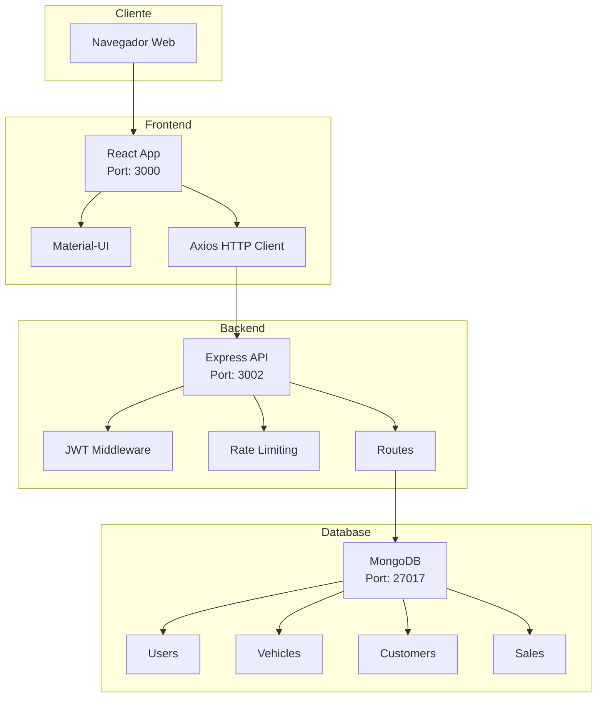
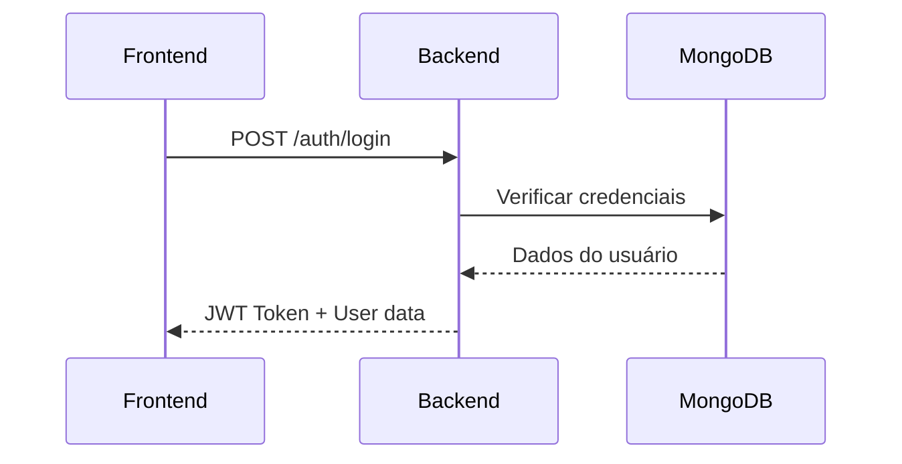
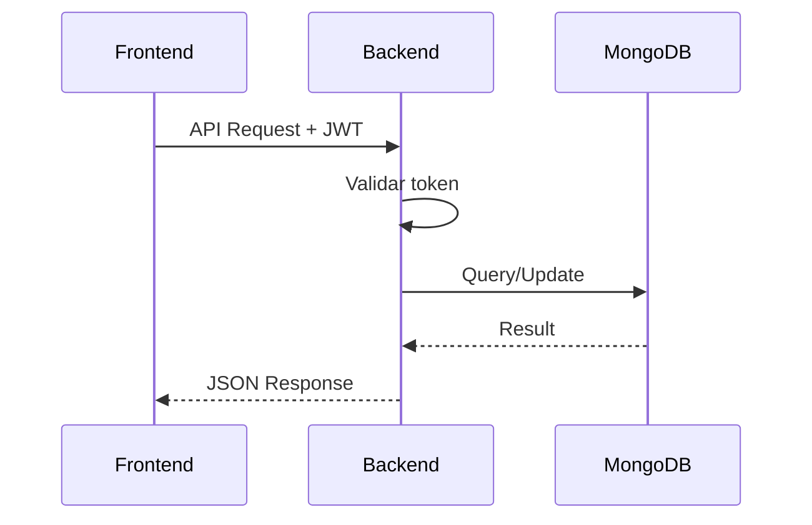
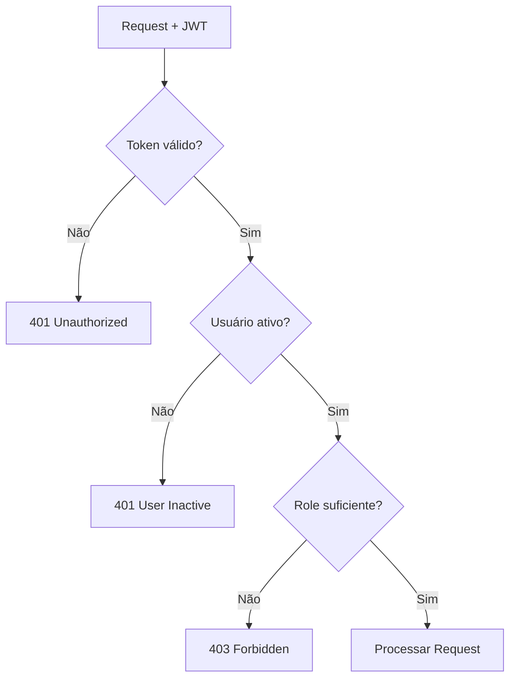
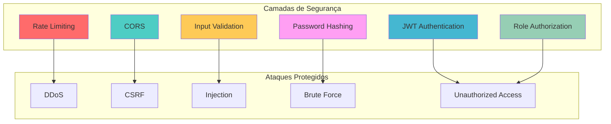

# 🏗️ Arquitetura do Sistema

## Visão Geral

O FIAP III de Veículos foi desenvolvido seguindo uma arquitetura moderna e escalável, utilizando tecnologias atuais e boas práticas de desenvolvimento.

## Arquitetura Geral

### Diagrama de Alto Nível


## Componentes do Sistema

### 1. Frontend (React + TypeScript)

**Localização**: `frontend/`

**Tecnologias**:
- React 18
- TypeScript
- Material-UI (MUI)
- Axios para requisições HTTP
- Context API para gerenciamento de estado

**Estrutura**:
```
frontend/src/
├── components/     # Componentes reutilizáveis
├── pages/         # Páginas da aplicação
├── contexts/      # Contextos React (Auth)
├── services/      # Serviços de API
├── types/         # Definições TypeScript
└── utils/         # Utilitários
```

**Funcionalidades**:
- Interface de usuário responsiva
- Autenticação e autorização
- Gerenciamento de veículos
- Gerenciamento de clientes
- Gerenciamento de vendas
- Dashboard com métricas

### 2. Backend (Node.js + Express)

**Localização**: `backend/`

**Tecnologias**:
- Node.js 18+
- Express.js
- MongoDB com Mongoose
- JWT para autenticação
- bcryptjs para hash de senhas
- express-rate-limit para rate limiting

**Estrutura**:
```
backend/src/
├── routes/        # Rotas da API
├── models/        # Modelos do banco de dados
├── middleware/    # Middlewares customizados
├── config/        # Configurações
└── utils/         # Utilitários
```

**Funcionalidades**:
- API REST completa
- Autenticação JWT
- Controle de roles
- Rate limiting
- Validação de dados
- Logs estruturados

### 3. Banco de Dados (MongoDB)

**Tecnologia**: MongoDB

**Coleções**:
- `users` - Usuários do sistema
- `vehicles` - Veículos disponíveis
- `customers` - Clientes
- `sales` - Vendas realizadas

## Fluxo de Dados

### 1. Autenticação


### 2. Operações CRUD


### 3. Autorização


## Padrões de Design

### 1. MVC (Model-View-Controller)
- **Model**: Mongoose schemas em `backend/src/models/`
- **View**: React components em `frontend/src/pages/`
- **Controller**: Express routes em `backend/src/routes/`

### 2. Repository Pattern
- Abstração da camada de dados
- Facilita testes e manutenção
- Implementado através do Mongoose

### 3. Middleware Pattern
- Autenticação
- Rate limiting
- Logging
- Error handling

## Segurança

### Diagrama de Segurança


### 1. Autenticação
- JWT tokens com expiração
- Refresh tokens para renovação
- Hash de senhas com bcryptjs

### 2. Autorização
- Controle de roles (ADMIN, SALES, CUSTOMER)
- Middleware de verificação de permissões
- Validação de propriedade de recursos

### 3. Rate Limiting
- Limite de requisições por IP
- Diferentes limites por endpoint
- Proteção contra ataques DDoS

### 4. Validação
- Validação de entrada de dados
- Sanitização de inputs
- Validação de tipos TypeScript

## Escalabilidade

### 1. Horizontal
- Stateless backend
- Load balancer ready
- Database sharding ready

### 2. Vertical
- Otimização de queries
- Caching strategies
- Connection pooling

## Monitoramento

### 1. Logs
- Logs estruturados
- Diferentes níveis (info, warn, error)
- Timestamps e context

### 2. Health Checks
- Endpoint `/health`
- Verificação de conectividade
- Status do sistema

## Deploy

### 1. Desenvolvimento
```bash
# Backend
cd backend && npm start

# Frontend
cd frontend && npm start
```

### 2. Produção
```bash
# Build frontend
cd frontend && npm run build

# Start backend
cd backend && npm start
```

## Considerações de Performance

### 1. Frontend
- Lazy loading de componentes
- Otimização de re-renders
- Caching de dados

### 2. Backend
- Connection pooling
- Índices no MongoDB
- Compressão de responses

### 3. Database
- Índices otimizados
- Queries eficientes
- Agregações quando necessário

## Manutenibilidade

### 1. Código Limpo
- Nomenclatura clara
- Funções pequenas
- Comentários relevantes

### 2. Testes
- Testes unitários
- Testes de integração
- Testes E2E

### 3. Documentação
- README detalhado
- Documentação da API
- Comentários no código

## Evolução Futura

### 1. Microserviços
- Separação por domínio
- Comunicação via API
- Deploy independente

### 2. Containerização
- Docker containers
- Kubernetes orchestration
- CI/CD pipeline

### 3. Observabilidade
- Métricas detalhadas
- Tracing distribuído
- Alertas automáticos
