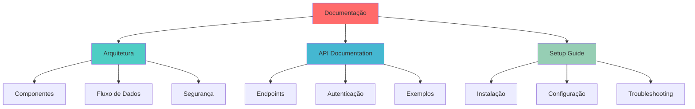

# 📚 Documentação do Sistema

Bem-vindo à documentação completa do FIAP III de Veículos. Esta documentação fornece todas as informações necessárias para entender, instalar, configurar e usar o sistema.

## 📖 Índice da Documentação

### Navegação da Documentação


### 🏗️ [Arquitetura](./ARCHITECTURE.md)
- Visão geral da arquitetura
- Componentes do sistema
- Fluxo de dados
- Padrões de design
- Segurança e escalabilidade

### 📚 [Documentação da API](./API_DOCUMENTATION.md)
- Endpoints disponíveis
- Autenticação e autorização
- Exemplos de uso
- Códigos de status
- Tratamento de erros

### 🚀 [Guia de Instalação](./SETUP_GUIDE.md)
- Pré-requisitos
- Instalação passo a passo
- Configuração de ambiente
- Troubleshooting
- Configuração de produção

## 🎯 Visão Geral do Sistema

O FIAP III de Veículos é uma aplicação web completa que permite:

- **Gerenciamento de Veículos**: CRUD completo com controle de status
- **Gerenciamento de Clientes**: Cadastro e busca de clientes
- **Gerenciamento de Vendas**: Processo completo de vendas
- **Autenticação e Autorização**: Sistema de roles e permissões
- **Dashboard**: Métricas e relatórios

## 🏗️ Arquitetura

O sistema foi desenvolvido com uma arquitetura moderna:

```
Frontend (React) ←→ Backend (Node.js) ←→ Database (MongoDB)
```

### Tecnologias Utilizadas

#### Frontend
- **React 18** - Framework de interface
- **TypeScript** - Tipagem estática
- **Material-UI** - Componentes de interface
- **Axios** - Cliente HTTP

#### Backend
- **Node.js** - Runtime JavaScript
- **Express.js** - Framework web
- **MongoDB** - Banco de dados
- **Mongoose** - ODM para MongoDB
- **JWT** - Autenticação

## 🚀 Início Rápido

### 1. Instalação
```bash
git clone <repository-url>
cd fiap-prova-sub-fase-3
```

### 2. Configuração do Backend
```bash
cd backend
npm install
cp config.env.example config.env
# Edite o config.env
npm start
```

### 3. Configuração do Frontend
```bash
cd frontend
npm install
npm start
```

### 4. Acesso
- **Frontend**: http://localhost:3000
- **API**: http://localhost:3002

## 👥 Roles e Permissões

### ADMIN
- Acesso total ao sistema
- Gerenciamento de usuários
- Relatórios e métricas

### SALES
- Gerenciamento de veículos
- Criação de vendas
- Visualização de clientes

### CUSTOMER
- Visualização de veículos
- Histórico de compras
- Atualização de perfil

## 🔐 Autenticação

O sistema utiliza JWT para autenticação:

1. **Login**: POST `/auth/login`
2. **Token**: Incluído no header `Authorization: Bearer <token>`
3. **Renovação**: POST `/auth/refresh`
4. **Logout**: POST `/auth/logout`

## 📊 Funcionalidades Principais

### Gestão de Veículos
- Listagem com filtros
- Criação e edição
- Controle de status
- Validação de dados

### Gestão de Clientes
- Cadastro completo
- Validação de CPF
- Busca avançada
- Estatísticas

### Gestão de Vendas
- Processo de venda
- Controle de pagamento
- Histórico completo
- Relatórios

## 🛠️ Desenvolvimento

### Estrutura do Projeto
```
fiap-prova-sub-fase-3/
├── backend/          # API Node.js
├── frontend/         # Aplicação React
└── docs/            # Documentação
```

### Scripts Disponíveis

#### Backend
```bash
npm start          # Iniciar servidor
npm run populate   # Popular dados
npm test          # Executar testes
```

#### Frontend
```bash
npm start         # Iniciar desenvolvimento
npm run build     # Build para produção
npm test         # Executar testes
```

## 🔧 Configuração

### Variáveis de Ambiente

#### Backend (`config.env`)
```env
PORT=3002
MONGODB_URL=mongodb://localhost:27017
JWT_SECRET=your-secret-key
ALLOWED_ORIGINS=http://localhost:3000
```

#### Frontend (`.env`)
```env
REACT_APP_BACKEND_URL=http://localhost:3002
```

## 📈 Monitoramento

### Health Check
```bash
curl http://localhost:3002/health
```

### Logs
- **Backend**: Console do servidor
- **Frontend**: Console do navegador
- **MongoDB**: Logs do container

## 🚀 Deploy

### Desenvolvimento
```bash
# Backend
cd backend && npm start

# Frontend
cd frontend && npm start
```

### Produção
```bash
# Build frontend
cd frontend && npm run build

# Iniciar backend
cd backend && npm start
```

## 🧪 Testes

### Testar API
```bash
cd backend
npm test
```

### Testar Frontend
```bash
cd frontend
npm test
```

### Testar Integração
```bash
# Health check
curl http://localhost:3002/health

# Login
curl -X POST http://localhost:3002/auth/login \
  -H "Content-Type: application/json" \
  -d '{"email": "admin@vehiclesales.com", "password": "admin123"}'
```

## 📞 Suporte

Para suporte e dúvidas:

1. **Consulte a documentação** completa
2. **Verifique os logs** para erros
3. **Entre em contato** com a equipe de desenvolvimento

## 📄 Licença

Este projeto está sob a licença MIT.

---

**Desenvolvido com ❤️ para FIAP**
