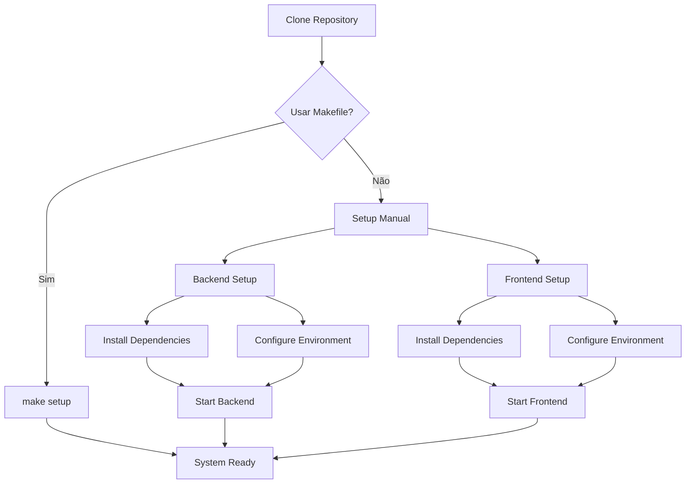
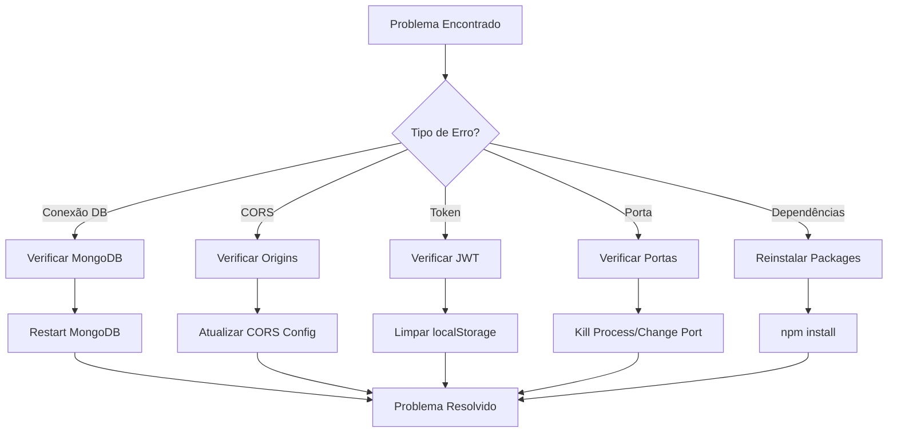

# 🚀 Guia de Instalação e Configuração

## Pré-requisitos

Antes de começar, certifique-se de ter instalado:

- **Node.js** 18+ ([Download](https://nodejs.org/))
- **MongoDB** ([Download](https://www.mongodb.com/try/download/community))
- **Git** ([Download](https://git-scm.com/))
- **Docker** (opcional, para MongoDB) ([Download](https://www.docker.com/))

## Instalação

### 🎯 Setup Rápido com Makefile (Recomendado)

```bash
# Clone o repositório
git clone <repository-url>
cd fiap-prova-sub-fase-3

# Setup completo automático
make setup

# Iniciar o sistema
make start
```

### Fluxo de Instalação


### 🔧 Setup Manual (Alternativo)

#### 1. Clone o Repositório

```bash
git clone <repository-url>
cd fiap-prova-sub-fase-3
```

#### 2. Configuração do Backend

```bash
cd backend
npm install
```

#### 3. Configuração do Frontend

```bash
cd frontend
npm install
```

## Configuração do Banco de Dados

### Opção 1: MongoDB Local

1. **Instale o MongoDB**:
   ```bash
   # Ubuntu/Debian
   sudo apt-get install mongodb
   
   # macOS
   brew install mongodb-community
   
   # Windows
   # Baixe e instale do site oficial
   ```

2. **Inicie o MongoDB**:
   ```bash
   # Ubuntu/Debian
   sudo systemctl start mongod
   
   # macOS
   brew services start mongodb-community
   
   # Windows
   # Inicie o serviço MongoDB
   ```

### Opção 2: MongoDB com Docker (Recomendado)

```bash
# Inicie o MongoDB em container
docker run -d --name mongodb-unified-dev -p 27017:27017 mongo:latest --noauth

# Verifique se está rodando
docker ps | grep mongo
```

## Configuração de Variáveis de Ambiente

### Backend

Crie o arquivo `backend/config.env`:

```env
# Servidor
PORT=3002
NODE_ENV=development

# Banco de dados
MONGODB_URL=mongodb://localhost:27017
MONGODB_DB_NAME=vehicle_sales

# JWT
JWT_SECRET=your-super-secret-jwt-key-change-this-in-production
JWT_REFRESH_SECRET=your-super-secret-refresh-key-change-this-in-production
JWT_EXPIRES_IN=24h
JWT_REFRESH_EXPIRES_IN=7d

# CORS
ALLOWED_ORIGINS=http://localhost:3000,http://localhost:3003

# Rate Limiting
RATE_LIMIT_WINDOW_MS=900000
RATE_LIMIT_MAX_REQUESTS=100

# Logs
LOG_LEVEL=info
```

### Frontend

Crie o arquivo `frontend/.env`:

```env
REACT_APP_BACKEND_URL=http://localhost:3002
```

## População de Dados Iniciais

### 1. Inicie o Backend

```bash
cd backend
npm start
```

### 2. Popule os Dados

Em outro terminal:

```bash
cd backend
npm run populate
```

Isso criará:
- Usuário admin padrão
- Veículos de exemplo
- Clientes de exemplo

### 3. Verifique os Dados

```bash
# Teste o login
curl -X POST http://localhost:3002/auth/login \
  -H "Content-Type: application/json" \
  -d '{"email": "admin@vehiclesales.com", "password": "admin123"}'
```

## Executando o Sistema

### Desenvolvimento

#### Terminal 1 - Backend
```bash
cd backend
npm start
```

#### Terminal 2 - Frontend
```bash
cd frontend
npm start
```

### Acessando o Sistema

- **Frontend**: http://localhost:3000
- **API**: http://localhost:3002
- **Health Check**: http://localhost:3002/health

## Credenciais Padrão

### Usuário Administrador
- **Email**: admin@vehiclesales.com
- **Senha**: admin123
- **Role**: ADMIN

## Verificação da Instalação

### 1. Teste da API

```bash
# Health check
curl http://localhost:3002/health

# Login
curl -X POST http://localhost:3002/auth/login \
  -H "Content-Type: application/json" \
  -d '{"email": "admin@vehiclesales.com", "password": "admin123"}'
```

### 2. Teste do Frontend

1. Acesse http://localhost:3000
2. Faça login com as credenciais padrão
3. Navegue pelas páginas para verificar se tudo está funcionando

## Troubleshooting

### Fluxo de Troubleshooting


### Problemas Comuns

#### 1. Erro de Conexão com MongoDB

**Sintoma**: `MongoServerError: connect ECONNREFUSED`

**Solução**:
```bash
# Verifique se o MongoDB está rodando
docker ps | grep mongo

# Se não estiver, inicie
docker run -d --name mongodb-unified-dev -p 27017:27017 mongo:latest --noauth
```

#### 2. Erro de CORS

**Sintoma**: `Access to XMLHttpRequest has been blocked by CORS policy`

**Solução**:
```bash
# Verifique se a porta do frontend está nas origens permitidas
# Edite backend/config.env
ALLOWED_ORIGINS=http://localhost:3000,http://localhost:3003
```

#### 3. Erro de Token Inválido

**Sintoma**: `Token inválido ou expirado`

**Solução**:
```bash
# Limpe o localStorage do navegador
# Ou faça logout e login novamente
```

#### 4. Erro de Porta em Uso

**Sintoma**: `EADDRINUSE: address already in use :::3002`

**Solução**:
```bash
# Encontre o processo usando a porta
lsof -i :3002

# Mate o processo
kill -9 <PID>

# Ou use uma porta diferente
# Edite backend/config.env
PORT=3003
```

#### 5. Erro de Dependências

**Sintoma**: `Module not found`

**Solução**:
```bash
# Reinstale as dependências
cd backend && rm -rf node_modules && npm install
cd frontend && rm -rf node_modules && npm install
```

### Logs e Debug

#### Backend
```bash
# Ver logs em tempo real
cd backend && npm start

# Logs são exibidos no console
```

#### Frontend
```bash
# Ver logs no console do navegador
# F12 -> Console
```

#### MongoDB
```bash
# Ver logs do MongoDB
docker logs mongodb-unified-dev
```

## Configuração de Produção

### 1. Variáveis de Ambiente

```env
# Backend - Produção
NODE_ENV=production
JWT_SECRET=your-super-secure-jwt-secret
JWT_REFRESH_SECRET=your-super-secure-refresh-secret
MONGODB_URL=mongodb://your-production-mongodb-url
ALLOWED_ORIGINS=https://your-frontend-domain.com
```

### 2. Build do Frontend

```bash
cd frontend
npm run build
```

### 3. Iniciar em Produção

```bash
cd backend
NODE_ENV=production npm start
```

## 🛠️ Makefile - Comandos Úteis

### Comandos Principais
```bash
make help          # Ver todos os comandos disponíveis
make setup         # Setup completo do projeto
make start         # Iniciar backend e frontend
make stop          # Parar todos os serviços
make status        # Ver status dos serviços
make health        # Verificar saúde dos serviços
```

### Comandos de Desenvolvimento
```bash
make dev           # Modo desenvolvimento
make start-backend # Apenas backend
make start-frontend # Apenas frontend
make logs          # Ver logs em tempo real
```

### Comandos de Gerenciamento
```bash
make clean         # Limpeza completa
make reset         # Reset completo
make backup        # Backup do banco
make restore       # Restaurar backup
```

### Comandos de Produção
```bash
make build         # Build para produção
make deploy        # Deploy local
make prod          # Modo produção
```

## Scripts Úteis (Alternativo)

### Backend

```bash
# Iniciar em desenvolvimento
npm start

# Popular dados
npm run populate

# Testes
npm test
```

### Frontend

```bash
# Iniciar em desenvolvimento
npm start

# Build para produção
npm run build

# Testes
npm test
```

## Estrutura de Arquivos

```
fiap-prova-sub-fase-3/
├── backend/
│   ├── src/
│   │   ├── routes/        # Rotas da API
│   │   ├── models/        # Modelos do banco
│   │   ├── middleware/    # Middlewares
│   │   └── utils/         # Utilitários
│   ├── config.env         # Variáveis de ambiente
│   └── package.json
├── frontend/
│   ├── src/
│   │   ├── pages/         # Páginas
│   │   ├── components/    # Componentes
│   │   └── services/      # Serviços de API
│   ├── .env               # Variáveis de ambiente
│   └── package.json
└── docs/                  # Documentação
```

## Próximos Passos

1. **Personalize** as configurações conforme necessário
2. **Configure** um banco de dados de produção
3. **Implemente** monitoramento e logs
4. **Configure** CI/CD pipeline
5. **Implemente** testes automatizados

## Suporte

Se encontrar problemas:

1. Verifique os logs
2. Consulte a documentação
3. Verifique as configurações
4. Entre em contato com a equipe de desenvolvimento
